# OrchardCore.Apis.GraphQL.Abstractions

## Overview

| Property | Value |
|----------|-------|
| Category | WebApp |
| Repository | src |
| Path | `OrchardCore/OrchardCore.Apis.GraphQL.Abstractions/OrchardCore.Apis.GraphQL.Abstractions.csproj` |
| Project References | 2 |
| NuGet Dependencies | 2 |
| Consumers | 18 |

## Dependency Diagram

```mermaid
graph TD
    OrchardCore_Apis_GraphQL_Abstractions["<strong>OrchardCore.Apis.GraphQL.Abstractions</strong>"]
    OrchardCore_DisplayManagement_Abstractions["OrchardCore.DisplayManagement.Abstractions"]
    OrchardCore_Apis_GraphQL_Abstractions --> OrchardCore_DisplayManagement_Abstractions
    OrchardCore_Infrastructure_Abstractions["OrchardCore.Infrastructure.Abstractions"]
    OrchardCore_Apis_GraphQL_Abstractions --> OrchardCore_Infrastructure_Abstractions
    OrchardCore_Taxonomies["OrchardCore.Taxonomies"]
    OrchardCore_Taxonomies -.-> OrchardCore_Apis_GraphQL_Abstractions
    OrchardCore_Users["OrchardCore.Users"]
    OrchardCore_Users -.-> OrchardCore_Apis_GraphQL_Abstractions
    OrchardCore_DataLocalization["OrchardCore.DataLocalization"]
    OrchardCore_DataLocalization -.-> OrchardCore_Apis_GraphQL_Abstractions
    OrchardCore_Autoroute["OrchardCore.Autoroute"]
    OrchardCore_Autoroute -.-> OrchardCore_Apis_GraphQL_Abstractions
    OrchardCore_Alias["OrchardCore.Alias"]
    OrchardCore_Alias -.-> OrchardCore_Apis_GraphQL_Abstractions
    OrchardCore_Lists["OrchardCore.Lists"]
    OrchardCore_Lists -.-> OrchardCore_Apis_GraphQL_Abstractions
    OrchardCore_Layers["OrchardCore.Layers"]
    OrchardCore_Layers -.-> OrchardCore_Apis_GraphQL_Abstractions
    OrchardCore_Localization["OrchardCore.Localization"]
    OrchardCore_Localization -.-> OrchardCore_Apis_GraphQL_Abstractions
    OrchardCore_Media["OrchardCore.Media"]
    OrchardCore_Media -.-> OrchardCore_Apis_GraphQL_Abstractions
    OrchardCore_Seo["OrchardCore.Seo"]
    OrchardCore_Seo -.-> OrchardCore_Apis_GraphQL_Abstractions
    OrchardCore_Html["OrchardCore.Html"]
    OrchardCore_Html -.-> OrchardCore_Apis_GraphQL_Abstractions
    OrchardCore_Markdown["OrchardCore.Markdown"]
    OrchardCore_Markdown -.-> OrchardCore_Apis_GraphQL_Abstractions
    OrchardCore_Demo["OrchardCore.Demo"]
    OrchardCore_Demo -.-> OrchardCore_Apis_GraphQL_Abstractions
    OrchardCore_Apis_GraphQL["OrchardCore.Apis.GraphQL"]
    OrchardCore_Apis_GraphQL -.-> OrchardCore_Apis_GraphQL_Abstractions
    OrchardCore_ContentLocalization["OrchardCore.ContentLocalization"]
    OrchardCore_ContentLocalization -.-> OrchardCore_Apis_GraphQL_Abstractions
    more_consumers["... +3 more"]
    more_consumers -.-> OrchardCore_Apis_GraphQL_Abstractions
```

## Project References
- OrchardCore.DisplayManagement.Abstractions
- OrchardCore.Infrastructure.Abstractions

## Consumed By
- OrchardCore.Taxonomies
- OrchardCore.Users
- OrchardCore.DataLocalization
- OrchardCore.Autoroute
- OrchardCore.Alias
- OrchardCore.Lists
- OrchardCore.Layers
- OrchardCore.Localization
- OrchardCore.Media
- OrchardCore.Seo
- OrchardCore.Html
- OrchardCore.Markdown
- OrchardCore.Demo
- OrchardCore.Apis.GraphQL
- OrchardCore.ContentLocalization
- OrchardCore.Forms
- OrchardCore.ContentManagement.GraphQL
- OrchardCore.Tests

## External NuGet Packages
| Package | Version |
|---------|---------||
| GraphQL |  |
| GraphQL.DataLoader |  |

---

*[Back to Index](../../index.md)*
