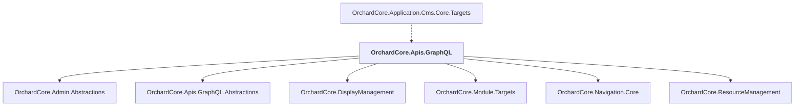

# OrchardCore.Apis.GraphQL

## Overview

| Property | Value |
|----------|-------|
| Category | WebApp |
| Repository | src |
| Path | `OrchardCore.Modules/OrchardCore.Apis.GraphQL/OrchardCore.Apis.GraphQL.csproj` |
| Project References | 6 |
| NuGet Dependencies | 5 |
| Consumers | 1 |

## Dependency Diagram

## Project References
- OrchardCore.Admin.Abstractions
- OrchardCore.Apis.GraphQL.Abstractions
- OrchardCore.DisplayManagement
- OrchardCore.Module.Targets
- OrchardCore.Navigation.Core
- OrchardCore.ResourceManagement

## Consumed By
- OrchardCore.Application.Cms.Core.Targets

## External NuGet Packages
| Package | Version |
|---------|---------||
| GraphQL |  |
| GraphQL.DataLoader |  |
| GraphQL.MicrosoftDI |  |
| GraphQL.SystemTextJson |  |
| YesSql.Abstractions |  |

---

*[Back to Index](../../index.md)*
