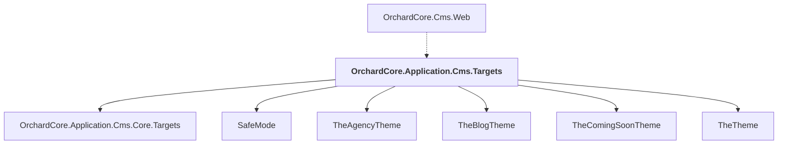

# OrchardCore.Application.Cms.Targets

## Overview

| Property | Value |
|----------|-------|
| Category | Library |
| Repository | src |
| Path | `OrchardCore/OrchardCore.Application.Cms.Targets/OrchardCore.Application.Cms.Targets.csproj` |
| Project References | 6 |
| NuGet Dependencies | 1 |
| Consumers | 1 |

## Dependency Diagram

## Project References
- OrchardCore.Application.Cms.Core.Targets
- SafeMode
- TheAgencyTheme
- TheBlogTheme
- TheComingSoonTheme
- TheTheme

## Consumed By
- OrchardCore.Cms.Web

## External NuGet Packages
| Package | Version |
|---------|---------||
| OrchardCore.Translations.All |  |

---

*[Back to Index](../../index.md)*
