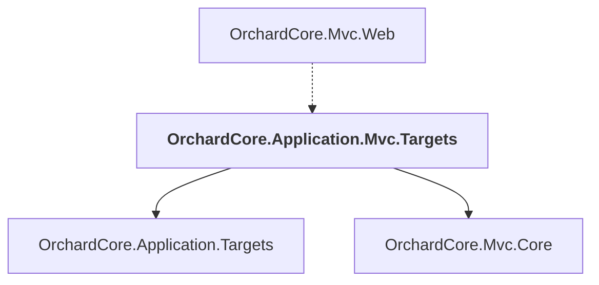

# OrchardCore.Application.Mvc.Targets

## Overview

| Property | Value |
|----------|-------|
| Category | Library |
| Repository | src |
| Path | `OrchardCore/OrchardCore.Application.Mvc.Targets/OrchardCore.Application.Mvc.Targets.csproj` |
| Project References | 2 |
| NuGet Dependencies | 0 |
| Consumers | 1 |

## Dependency Diagram

## Project References
- OrchardCore.Application.Targets
- OrchardCore.Mvc.Core

## Consumed By
- OrchardCore.Mvc.Web

---

*[Back to Index](../../index.md)*
