# OrchardCore.ArchiveLater

## Overview

| Property | Value |
|----------|-------|
| Category | Library |
| Repository | src |
| Path | `OrchardCore.Modules/OrchardCore.ArchiveLater/OrchardCore.ArchiveLater.csproj` |
| Project References | 8 |
| NuGet Dependencies | 0 |
| Consumers | 1 |

## Dependency Diagram

```mermaid
graph TD
    OrchardCore_ArchiveLater["<strong>OrchardCore.ArchiveLater</strong>"]
    OrchardCore_ContentManagement["OrchardCore.ContentManagement"]
    OrchardCore_ArchiveLater --> OrchardCore_ContentManagement
    OrchardCore_ContentManagement_Display["OrchardCore.ContentManagement.Display"]
    OrchardCore_ArchiveLater --> OrchardCore_ContentManagement_Display
    OrchardCore_Contents_Core["OrchardCore.Contents.Core"]
    OrchardCore_ArchiveLater --> OrchardCore_Contents_Core
    OrchardCore_Data_Abstractions["OrchardCore.Data.Abstractions"]
    OrchardCore_ArchiveLater --> OrchardCore_Data_Abstractions
    OrchardCore_Data_YesSql["OrchardCore.Data.YesSql"]
    OrchardCore_ArchiveLater --> OrchardCore_Data_YesSql
    OrchardCore_DisplayManagement["OrchardCore.DisplayManagement"]
    OrchardCore_ArchiveLater --> OrchardCore_DisplayManagement
    OrchardCore_Module_Targets["OrchardCore.Module.Targets"]
    OrchardCore_ArchiveLater --> OrchardCore_Module_Targets
    OrchardCore_ResourceManagement["OrchardCore.ResourceManagement"]
    OrchardCore_ArchiveLater --> OrchardCore_ResourceManagement
    OrchardCore_Application_Cms_Core_Targets["OrchardCore.Application.Cms.Core.Targets"]
    OrchardCore_Application_Cms_Core_Targets -.-> OrchardCore_ArchiveLater
```

## Project References
- OrchardCore.ContentManagement
- OrchardCore.ContentManagement.Display
- OrchardCore.Contents.Core
- OrchardCore.Data.Abstractions
- OrchardCore.Data.YesSql
- OrchardCore.DisplayManagement
- OrchardCore.Module.Targets
- OrchardCore.ResourceManagement

## Consumed By
- OrchardCore.Application.Cms.Core.Targets

---

*[Back to Index](../../index.md)*
