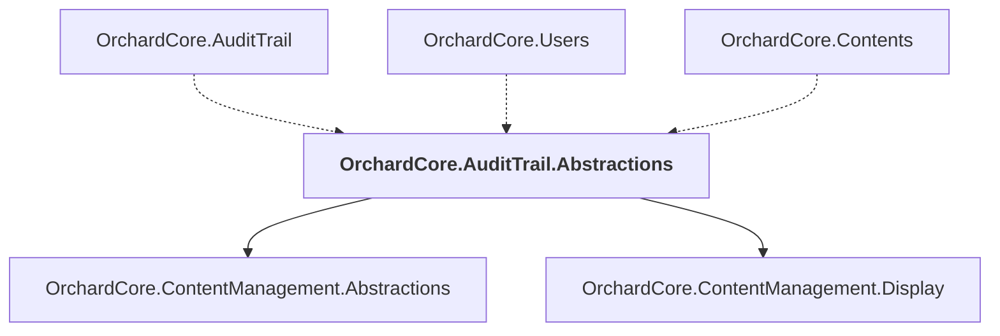

# OrchardCore.AuditTrail.Abstractions

## Overview

| Property | Value |
|----------|-------|
| Category | Library |
| Repository | src |
| Path | `OrchardCore/OrchardCore.AuditTrail.Abstractions/OrchardCore.AuditTrail.Abstractions.csproj` |
| Project References | 2 |
| NuGet Dependencies | 1 |
| Consumers | 3 |

## Dependency Diagram

## Project References
- OrchardCore.ContentManagement.Abstractions
- OrchardCore.ContentManagement.Display

## Consumed By
- OrchardCore.AuditTrail
- OrchardCore.Users
- OrchardCore.Contents

## External NuGet Packages
| Package | Version |
|---------|---------||
| YesSql.Filters.Query |  |

---

*[Back to Index](../../index.md)*
