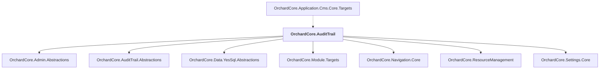

# OrchardCore.AuditTrail

## Overview

| Property | Value |
|----------|-------|
| Category | Library |
| Repository | src |
| Path | `OrchardCore.Modules/OrchardCore.AuditTrail/OrchardCore.AuditTrail.csproj` |
| Project References | 7 |
| NuGet Dependencies | 2 |
| Consumers | 1 |

## Dependency Diagram

## Project References
- OrchardCore.Admin.Abstractions
- OrchardCore.AuditTrail.Abstractions
- OrchardCore.Data.YesSql.Abstractions
- OrchardCore.Module.Targets
- OrchardCore.Navigation.Core
- OrchardCore.ResourceManagement
- OrchardCore.Settings.Core

## Consumed By
- OrchardCore.Application.Cms.Core.Targets

## External NuGet Packages
| Package | Version |
|---------|---------||
| YesSql.Core |  |
| YesSql.Filters.Query |  |

---

*[Back to Index](../../index.md)*
