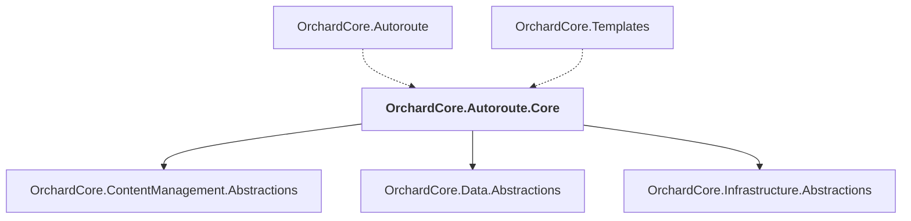

# OrchardCore.Autoroute.Core

## Overview

| Property | Value |
|----------|-------|
| Category | Library |
| Repository | src |
| Path | `OrchardCore/OrchardCore.Autoroute.Core/OrchardCore.Autoroute.Core.csproj` |
| Project References | 3 |
| NuGet Dependencies | 0 |
| Consumers | 2 |

## Dependency Diagram

## Project References
- OrchardCore.ContentManagement.Abstractions
- OrchardCore.Data.Abstractions
- OrchardCore.Infrastructure.Abstractions

## Consumed By
- OrchardCore.Autoroute
- OrchardCore.Templates

---

*[Back to Index](../../index.md)*
