# OrchardCore.Autoroute

## Overview

| Property | Value |
|----------|-------|
| Category | Library |
| Repository | src |
| Path | `OrchardCore.Modules/OrchardCore.Autoroute/OrchardCore.Autoroute.csproj` |
| Project References | 15 |
| NuGet Dependencies | 0 |
| Consumers | 1 |

## Dependency Diagram

```mermaid
graph TD
    OrchardCore_Autoroute["<strong>OrchardCore.Autoroute</strong>"]
    OrchardCore_Apis_GraphQL_Abstractions["OrchardCore.Apis.GraphQL.Abstractions"]
    OrchardCore_Autoroute --> OrchardCore_Apis_GraphQL_Abstractions
    OrchardCore_Autoroute_Core["OrchardCore.Autoroute.Core"]
    OrchardCore_Autoroute --> OrchardCore_Autoroute_Core
    OrchardCore_ContentLocalization_Abstractions["OrchardCore.ContentLocalization.Abstractions"]
    OrchardCore_Autoroute --> OrchardCore_ContentLocalization_Abstractions
    OrchardCore_ContentManagement_GraphQL["OrchardCore.ContentManagement.GraphQL"]
    OrchardCore_Autoroute --> OrchardCore_ContentManagement_GraphQL
    OrchardCore_ContentManagement_Abstractions["OrchardCore.ContentManagement.Abstractions"]
    OrchardCore_Autoroute --> OrchardCore_ContentManagement_Abstractions
    OrchardCore_ContentManagement_Display["OrchardCore.ContentManagement.Display"]
    OrchardCore_Autoroute --> OrchardCore_ContentManagement_Display
    OrchardCore_ContentTypes_Abstractions["OrchardCore.ContentTypes.Abstractions"]
    OrchardCore_Autoroute --> OrchardCore_ContentTypes_Abstractions
    OrchardCore_Contents_TagHelpers["OrchardCore.Contents.TagHelpers"]
    OrchardCore_Autoroute --> OrchardCore_Contents_TagHelpers
    OrchardCore_DisplayManagement_Liquid["OrchardCore.DisplayManagement.Liquid"]
    OrchardCore_Autoroute --> OrchardCore_DisplayManagement_Liquid
    OrchardCore_Indexing_Abstractions["OrchardCore.Indexing.Abstractions"]
    OrchardCore_Autoroute --> OrchardCore_Indexing_Abstractions
    OrchardCore_Liquid_Abstractions["OrchardCore.Liquid.Abstractions"]
    OrchardCore_Autoroute --> OrchardCore_Liquid_Abstractions
    OrchardCore_MetaWeblog_Abstractions["OrchardCore.MetaWeblog.Abstractions"]
    OrchardCore_Autoroute --> OrchardCore_MetaWeblog_Abstractions
    OrchardCore_Module_Targets["OrchardCore.Module.Targets"]
    OrchardCore_Autoroute --> OrchardCore_Module_Targets
    OrchardCore_ResourceManagement["OrchardCore.ResourceManagement"]
    OrchardCore_Autoroute --> OrchardCore_ResourceManagement
    OrchardCore_Sitemaps_Abstractions["OrchardCore.Sitemaps.Abstractions"]
    OrchardCore_Autoroute --> OrchardCore_Sitemaps_Abstractions
    OrchardCore_Application_Cms_Core_Targets["OrchardCore.Application.Cms.Core.Targets"]
    OrchardCore_Application_Cms_Core_Targets -.-> OrchardCore_Autoroute
```

## Project References
- OrchardCore.Apis.GraphQL.Abstractions
- OrchardCore.Autoroute.Core
- OrchardCore.ContentLocalization.Abstractions
- OrchardCore.ContentManagement.GraphQL
- OrchardCore.ContentManagement.Abstractions
- OrchardCore.ContentManagement.Display
- OrchardCore.ContentTypes.Abstractions
- OrchardCore.Contents.TagHelpers
- OrchardCore.DisplayManagement.Liquid
- OrchardCore.Indexing.Abstractions
- OrchardCore.Liquid.Abstractions
- OrchardCore.MetaWeblog.Abstractions
- OrchardCore.Module.Targets
- OrchardCore.ResourceManagement
- OrchardCore.Sitemaps.Abstractions

## Consumed By
- OrchardCore.Application.Cms.Core.Targets

---

*[Back to Index](../../index.md)*
