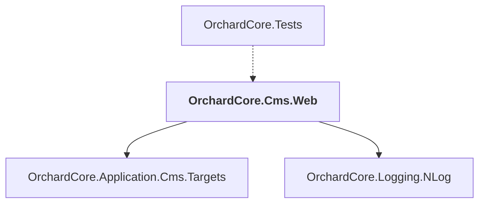

# OrchardCore.Cms.Web

## Overview

| Property | Value |
|----------|-------|
| Category | WebApp |
| Repository | src |
| Path | `OrchardCore.Cms.Web/OrchardCore.Cms.Web.csproj` |
| Project References | 2 |
| NuGet Dependencies | 1 |
| Consumers | 1 |

## Dependency Diagram

## Project References
- OrchardCore.Application.Cms.Targets
- OrchardCore.Logging.NLog

## Consumed By
- OrchardCore.Tests

## External NuGet Packages
| Package | Version |
|---------|---------||
| Microsoft.AspNetCore.Mvc.Razor.RuntimeCompilation |  |

---

*[Back to Index](../../index.md)*
