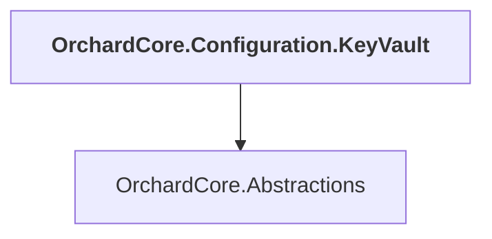

# OrchardCore.Configuration.KeyVault

## Overview

| Property | Value |
|----------|-------|
| Category | Library |
| Repository | src |
| Path | `OrchardCore/OrchardCore.Configuration.KeyVault/OrchardCore.Configuration.KeyVault.csproj` |
| Project References | 1 |
| NuGet Dependencies | 2 |
| Consumers | 0 |

## Dependency Diagram

## Project References
- OrchardCore.Abstractions

## External NuGet Packages
| Package | Version |
|---------|---------||
| Azure.Extensions.AspNetCore.Configuration.Secrets |  |
| Azure.Identity |  |

---

*[Back to Index](../../index.md)*
