# OrchardCore.ContentFields

## Overview

| Property | Value |
|----------|-------|
| Category | Library |
| Repository | src |
| Path | `OrchardCore.Modules/OrchardCore.ContentFields/OrchardCore.ContentFields.csproj` |
| Project References | 14 |
| NuGet Dependencies | 1 |
| Consumers | 1 |

## Dependency Diagram

```mermaid
graph TD
    OrchardCore_ContentFields["<strong>OrchardCore.ContentFields</strong>"]
    OrchardCore_Admin_Abstractions["OrchardCore.Admin.Abstractions"]
    OrchardCore_ContentFields --> OrchardCore_Admin_Abstractions
    OrchardCore_ContentLocalization_Abstractions["OrchardCore.ContentLocalization.Abstractions"]
    OrchardCore_ContentFields --> OrchardCore_ContentLocalization_Abstractions
    OrchardCore_ContentManagement_Abstractions["OrchardCore.ContentManagement.Abstractions"]
    OrchardCore_ContentFields --> OrchardCore_ContentManagement_Abstractions
    OrchardCore_ContentManagement_Display["OrchardCore.ContentManagement.Display"]
    OrchardCore_ContentFields --> OrchardCore_ContentManagement_Display
    OrchardCore_ContentManagement_GraphQL["OrchardCore.ContentManagement.GraphQL"]
    OrchardCore_ContentFields --> OrchardCore_ContentManagement_GraphQL
    OrchardCore_Contents_Core["OrchardCore.Contents.Core"]
    OrchardCore_ContentFields --> OrchardCore_Contents_Core
    OrchardCore_Contents_TagHelpers["OrchardCore.Contents.TagHelpers"]
    OrchardCore_ContentFields --> OrchardCore_Contents_TagHelpers
    OrchardCore_ContentTypes_Abstractions["OrchardCore.ContentTypes.Abstractions"]
    OrchardCore_ContentFields --> OrchardCore_ContentTypes_Abstractions
    OrchardCore_Indexing_Abstractions["OrchardCore.Indexing.Abstractions"]
    OrchardCore_ContentFields --> OrchardCore_Indexing_Abstractions
    OrchardCore_Liquid_Abstractions["OrchardCore.Liquid.Abstractions"]
    OrchardCore_ContentFields --> OrchardCore_Liquid_Abstractions
    OrchardCore_Module_Targets["OrchardCore.Module.Targets"]
    OrchardCore_ContentFields --> OrchardCore_Module_Targets
    OrchardCore_Shortcodes_Abstractions["OrchardCore.Shortcodes.Abstractions"]
    OrchardCore_ContentFields --> OrchardCore_Shortcodes_Abstractions
    OrchardCore_ResourceManagement["OrchardCore.ResourceManagement"]
    OrchardCore_ContentFields --> OrchardCore_ResourceManagement
    OrchardCore_Users_Core["OrchardCore.Users.Core"]
    OrchardCore_ContentFields --> OrchardCore_Users_Core
    OrchardCore_Application_Cms_Core_Targets["OrchardCore.Application.Cms.Core.Targets"]
    OrchardCore_Application_Cms_Core_Targets -.-> OrchardCore_ContentFields
```

## Project References
- OrchardCore.Admin.Abstractions
- OrchardCore.ContentLocalization.Abstractions
- OrchardCore.ContentManagement.Abstractions
- OrchardCore.ContentManagement.Display
- OrchardCore.ContentManagement.GraphQL
- OrchardCore.Contents.Core
- OrchardCore.Contents.TagHelpers
- OrchardCore.ContentTypes.Abstractions
- OrchardCore.Indexing.Abstractions
- OrchardCore.Liquid.Abstractions
- OrchardCore.Module.Targets
- OrchardCore.Shortcodes.Abstractions
- OrchardCore.ResourceManagement
- OrchardCore.Users.Core

## Consumed By
- OrchardCore.Application.Cms.Core.Targets

## External NuGet Packages
| Package | Version |
|---------|---------||
| Jint |  |

---

*[Back to Index](../../index.md)*
