# OrchardCore.ContentLocalization.Abstractions

## Overview

| Property | Value |
|----------|-------|
| Category | Localization |
| Repository | src |
| Path | `OrchardCore/OrchardCore.ContentLocalization.Abstractions/OrchardCore.ContentLocalization.Abstractions.csproj` |
| Project References | 3 |
| NuGet Dependencies | 0 |
| Consumers | 12 |

## Dependency Diagram

```mermaid
graph TD
    OrchardCore_ContentLocalization_Abstractions["<strong>OrchardCore.ContentLocalization.Abstractions</strong>"]
    OrchardCore_Abstractions["OrchardCore.Abstractions"]
    OrchardCore_ContentLocalization_Abstractions --> OrchardCore_Abstractions
    OrchardCore_ContentManagement_Abstractions["OrchardCore.ContentManagement.Abstractions"]
    OrchardCore_ContentLocalization_Abstractions --> OrchardCore_ContentManagement_Abstractions
    OrchardCore_Infrastructure_Abstractions["OrchardCore.Infrastructure.Abstractions"]
    OrchardCore_ContentLocalization_Abstractions --> OrchardCore_Infrastructure_Abstractions
    OrchardCore_ContentFields["OrchardCore.ContentFields"]
    OrchardCore_ContentFields -.-> OrchardCore_ContentLocalization_Abstractions
    OrchardCore_Autoroute["OrchardCore.Autoroute"]
    OrchardCore_Autoroute -.-> OrchardCore_ContentLocalization_Abstractions
    OrchardCore_Alias["OrchardCore.Alias"]
    OrchardCore_Alias -.-> OrchardCore_ContentLocalization_Abstractions
    OrchardCore_Lists["OrchardCore.Lists"]
    OrchardCore_Lists -.-> OrchardCore_ContentLocalization_Abstractions
    OrchardCore_Search_Lucene["OrchardCore.Search.Lucene"]
    OrchardCore_Search_Lucene -.-> OrchardCore_ContentLocalization_Abstractions
    OrchardCore_Html["OrchardCore.Html"]
    OrchardCore_Html -.-> OrchardCore_ContentLocalization_Abstractions
    OrchardCore_Title["OrchardCore.Title"]
    OrchardCore_Title -.-> OrchardCore_ContentLocalization_Abstractions
    OrchardCore_Markdown["OrchardCore.Markdown"]
    OrchardCore_Markdown -.-> OrchardCore_ContentLocalization_Abstractions
    OrchardCore_ContentLocalization["OrchardCore.ContentLocalization"]
    OrchardCore_ContentLocalization -.-> OrchardCore_ContentLocalization_Abstractions
    OrchardCore_Indexing_Core["OrchardCore.Indexing.Core"]
    OrchardCore_Indexing_Core -.-> OrchardCore_ContentLocalization_Abstractions
    OrchardCore_Search_Elasticsearch_Core["OrchardCore.Search.Elasticsearch.Core"]
    OrchardCore_Search_Elasticsearch_Core -.-> OrchardCore_ContentLocalization_Abstractions
    OrchardCore_Search_AzureAI_Core["OrchardCore.Search.AzureAI.Core"]
    OrchardCore_Search_AzureAI_Core -.-> OrchardCore_ContentLocalization_Abstractions
```

## Project References
- OrchardCore.Abstractions
- OrchardCore.ContentManagement.Abstractions
- OrchardCore.Infrastructure.Abstractions

## Consumed By
- OrchardCore.ContentFields
- OrchardCore.Autoroute
- OrchardCore.Alias
- OrchardCore.Lists
- OrchardCore.Search.Lucene
- OrchardCore.Html
- OrchardCore.Title
- OrchardCore.Markdown
- OrchardCore.ContentLocalization
- OrchardCore.Indexing.Core
- OrchardCore.Search.Elasticsearch.Core
- OrchardCore.Search.AzureAI.Core

---

*[Back to Index](../../index.md)*
