# OrchardCore.ContentManagement.Abstractions

## Overview

| Property | Value |
|----------|-------|
| Category | Library |
| Repository | src |
| Path | `OrchardCore/OrchardCore.ContentManagement.Abstractions/OrchardCore.ContentManagement.Abstractions.csproj` |
| Project References | 1 |
| NuGet Dependencies | 0 |
| Consumers | 46 |

## Dependency Diagram

```mermaid
graph TD
    OrchardCore_ContentManagement_Abstractions["<strong>OrchardCore.ContentManagement.Abstractions</strong>"]
    OrchardCore_Data_YesSql_Abstractions["OrchardCore.Data.YesSql.Abstractions"]
    OrchardCore_ContentManagement_Abstractions --> OrchardCore_Data_YesSql_Abstractions
    OrchardCore_Queries["OrchardCore.Queries"]
    OrchardCore_Queries -.-> OrchardCore_ContentManagement_Abstractions
    OrchardCore_ContentPreview["OrchardCore.ContentPreview"]
    OrchardCore_ContentPreview -.-> OrchardCore_ContentManagement_Abstractions
    OrchardCore_Twitter["OrchardCore.Twitter"]
    OrchardCore_Twitter -.-> OrchardCore_ContentManagement_Abstractions
    OrchardCore_Features["OrchardCore.Features"]
    OrchardCore_Features -.-> OrchardCore_ContentManagement_Abstractions
    OrchardCore_Taxonomies["OrchardCore.Taxonomies"]
    OrchardCore_Taxonomies -.-> OrchardCore_ContentManagement_Abstractions
    OrchardCore_Flows["OrchardCore.Flows"]
    OrchardCore_Flows -.-> OrchardCore_ContentManagement_Abstractions
    OrchardCore_Microsoft_Authentication["OrchardCore.Microsoft.Authentication"]
    OrchardCore_Microsoft_Authentication -.-> OrchardCore_ContentManagement_Abstractions
    OrchardCore_Workflows["OrchardCore.Workflows"]
    OrchardCore_Workflows -.-> OrchardCore_ContentManagement_Abstractions
    OrchardCore_ContentFields["OrchardCore.ContentFields"]
    OrchardCore_ContentFields -.-> OrchardCore_ContentManagement_Abstractions
    OrchardCore_OpenId["OrchardCore.OpenId"]
    OrchardCore_OpenId -.-> OrchardCore_ContentManagement_Abstractions
    OrchardCore_Autoroute["OrchardCore.Autoroute"]
    OrchardCore_Autoroute -.-> OrchardCore_ContentManagement_Abstractions
    OrchardCore_GitHub["OrchardCore.GitHub"]
    OrchardCore_GitHub -.-> OrchardCore_ContentManagement_Abstractions
    OrchardCore_Menu["OrchardCore.Menu"]
    OrchardCore_Menu -.-> OrchardCore_ContentManagement_Abstractions
    OrchardCore_Alias["OrchardCore.Alias"]
    OrchardCore_Alias -.-> OrchardCore_ContentManagement_Abstractions
    OrchardCore_Facebook["OrchardCore.Facebook"]
    OrchardCore_Facebook -.-> OrchardCore_ContentManagement_Abstractions
    more_consumers["... +31 more"]
    more_consumers -.-> OrchardCore_ContentManagement_Abstractions
```

## Project References
- OrchardCore.Data.YesSql.Abstractions

## Consumed By
- OrchardCore.Queries
- OrchardCore.ContentPreview
- OrchardCore.Twitter
- OrchardCore.Features
- OrchardCore.Taxonomies
- OrchardCore.Flows
- OrchardCore.Microsoft.Authentication
- OrchardCore.Workflows
- OrchardCore.ContentFields
- OrchardCore.OpenId
- OrchardCore.Autoroute
- OrchardCore.GitHub
- OrchardCore.Menu
- OrchardCore.Alias
- OrchardCore.Facebook
- OrchardCore.Layers
- OrchardCore.Media
- OrchardCore.Sitemaps
- OrchardCore.Seo
- OrchardCore.Html
- OrchardCore.Title
- OrchardCore.Markdown
- OrchardCore.CustomSettings
- OrchardCore.Widgets
- OrchardCore.Templates
- OrchardCore.Spatial
- OrchardCore.ContentLocalization
- OrchardCore.ReCaptcha
- OrchardCore.ContentTypes
- OrchardCore.Placements
- OrchardCore.Notifications.Core
- OrchardCore.Sitemaps.Abstractions
- OrchardCore.Indexing.Abstractions
- OrchardCore.MetaWeblog.Abstractions
- OrchardCore.Contents.TagHelpers
- OrchardCore.Search.AzureAI.Core
- OrchardCore.ContentManagement.GraphQL
- OrchardCore.Media.Abstractions
- OrchardCore.Flows.Core
- OrchardCore.Taxonomies.Core
- OrchardCore.Autoroute.Core
- OrchardCore.ContentManagement.Display
- OrchardCore.ContentManagement
- OrchardCore.AuditTrail.Abstractions
- OrchardCore.ContentLocalization.Abstractions
- OrchardCore.ContentTypes.Abstractions

---

*[Back to Index](../../index.md)*
