# OrchardCore.ContentManagement.Display

## Overview

| Property | Value |
|----------|-------|
| Category | Library |
| Repository | src |
| Path | `OrchardCore/OrchardCore.ContentManagement.Display/OrchardCore.ContentManagement.Display.csproj` |
| Project References | 2 |
| NuGet Dependencies | 0 |
| Consumers | 34 |

## Dependency Diagram

```mermaid
graph TD
    OrchardCore_ContentManagement_Display["<strong>OrchardCore.ContentManagement.Display</strong>"]
    OrchardCore_ContentManagement_Abstractions["OrchardCore.ContentManagement.Abstractions"]
    OrchardCore_ContentManagement_Display --> OrchardCore_ContentManagement_Abstractions
    OrchardCore_DisplayManagement["OrchardCore.DisplayManagement"]
    OrchardCore_ContentManagement_Display --> OrchardCore_DisplayManagement
    OrchardCore_Queries["OrchardCore.Queries"]
    OrchardCore_Queries -.-> OrchardCore_ContentManagement_Display
    OrchardCore_AdminMenu["OrchardCore.AdminMenu"]
    OrchardCore_AdminMenu -.-> OrchardCore_ContentManagement_Display
    OrchardCore_ContentPreview["OrchardCore.ContentPreview"]
    OrchardCore_ContentPreview -.-> OrchardCore_ContentManagement_Display
    OrchardCore_Media_Azure["OrchardCore.Media.Azure"]
    OrchardCore_Media_Azure -.-> OrchardCore_ContentManagement_Display
    OrchardCore_Flows["OrchardCore.Flows"]
    OrchardCore_Flows -.-> OrchardCore_ContentManagement_Display
    OrchardCore_PublishLater["OrchardCore.PublishLater"]
    OrchardCore_PublishLater -.-> OrchardCore_ContentManagement_Display
    OrchardCore_ArchiveLater["OrchardCore.ArchiveLater"]
    OrchardCore_ArchiveLater -.-> OrchardCore_ContentManagement_Display
    OrchardCore_Workflows["OrchardCore.Workflows"]
    OrchardCore_Workflows -.-> OrchardCore_ContentManagement_Display
    OrchardCore_Users["OrchardCore.Users"]
    OrchardCore_Users -.-> OrchardCore_ContentManagement_Display
    OrchardCore_ContentFields["OrchardCore.ContentFields"]
    OrchardCore_ContentFields -.-> OrchardCore_ContentManagement_Display
    OrchardCore_Notifications["OrchardCore.Notifications"]
    OrchardCore_Notifications -.-> OrchardCore_ContentManagement_Display
    OrchardCore_Rules["OrchardCore.Rules"]
    OrchardCore_Rules -.-> OrchardCore_ContentManagement_Display
    OrchardCore_AdminDashboard["OrchardCore.AdminDashboard"]
    OrchardCore_AdminDashboard -.-> OrchardCore_ContentManagement_Display
    OrchardCore_Autoroute["OrchardCore.Autoroute"]
    OrchardCore_Autoroute -.-> OrchardCore_ContentManagement_Display
    OrchardCore_Menu["OrchardCore.Menu"]
    OrchardCore_Menu -.-> OrchardCore_ContentManagement_Display
    more_consumers["... +19 more"]
    more_consumers -.-> OrchardCore_ContentManagement_Display
```

## Project References
- OrchardCore.ContentManagement.Abstractions
- OrchardCore.DisplayManagement

## Consumed By
- OrchardCore.Queries
- OrchardCore.AdminMenu
- OrchardCore.ContentPreview
- OrchardCore.Media.Azure
- OrchardCore.Flows
- OrchardCore.PublishLater
- OrchardCore.ArchiveLater
- OrchardCore.Workflows
- OrchardCore.Users
- OrchardCore.ContentFields
- OrchardCore.Notifications
- OrchardCore.Rules
- OrchardCore.AdminDashboard
- OrchardCore.Autoroute
- OrchardCore.Menu
- OrchardCore.Lists
- OrchardCore.Contents
- OrchardCore.Media.AmazonS3
- OrchardCore.Layers
- OrchardCore.Search.Lucene
- OrchardCore.Media
- OrchardCore.Seo
- OrchardCore.Html
- OrchardCore.Title
- OrchardCore.Markdown
- OrchardCore.Demo
- OrchardCore.Widgets
- OrchardCore.Spatial
- OrchardCore.ReCaptcha
- OrchardCore.Forms
- OrchardCore.ContentTypes
- OrchardCore.ContentManagement.GraphQL
- OrchardCore.AuditTrail.Abstractions
- OrchardCore.ContentTypes.Abstractions

---

*[Back to Index](../../index.md)*
