# OrchardCore.ContentManagement.GraphQL

## Overview

| Property | Value |
|----------|-------|
| Category | Library |
| Repository | src |
| Path | `OrchardCore/OrchardCore.ContentManagement.GraphQL/OrchardCore.ContentManagement.GraphQL.csproj` |
| Project References | 6 |
| NuGet Dependencies | 0 |
| Consumers | 20 |

## Dependency Diagram

```mermaid
graph TD
    OrchardCore_ContentManagement_GraphQL["<strong>OrchardCore.ContentManagement.GraphQL</strong>"]
    OrchardCore_Apis_GraphQL_Abstractions["OrchardCore.Apis.GraphQL.Abstractions"]
    OrchardCore_ContentManagement_GraphQL --> OrchardCore_Apis_GraphQL_Abstractions
    OrchardCore_ContentManagement_Abstractions["OrchardCore.ContentManagement.Abstractions"]
    OrchardCore_ContentManagement_GraphQL --> OrchardCore_ContentManagement_Abstractions
    OrchardCore_ContentTypes_Abstractions["OrchardCore.ContentTypes.Abstractions"]
    OrchardCore_ContentManagement_GraphQL --> OrchardCore_ContentTypes_Abstractions
    OrchardCore_ContentManagement_Display["OrchardCore.ContentManagement.Display"]
    OrchardCore_ContentManagement_GraphQL --> OrchardCore_ContentManagement_Display
    OrchardCore_ContentManagement["OrchardCore.ContentManagement"]
    OrchardCore_ContentManagement_GraphQL --> OrchardCore_ContentManagement
    OrchardCore_Contents_Core["OrchardCore.Contents.Core"]
    OrchardCore_ContentManagement_GraphQL --> OrchardCore_Contents_Core
    OrchardCore_Queries["OrchardCore.Queries"]
    OrchardCore_Queries -.-> OrchardCore_ContentManagement_GraphQL
    OrchardCore_Taxonomies["OrchardCore.Taxonomies"]
    OrchardCore_Taxonomies -.-> OrchardCore_ContentManagement_GraphQL
    OrchardCore_Flows["OrchardCore.Flows"]
    OrchardCore_Flows -.-> OrchardCore_ContentManagement_GraphQL
    OrchardCore_Users["OrchardCore.Users"]
    OrchardCore_Users -.-> OrchardCore_ContentManagement_GraphQL
    OrchardCore_Search_Elasticsearch["OrchardCore.Search.Elasticsearch"]
    OrchardCore_Search_Elasticsearch -.-> OrchardCore_ContentManagement_GraphQL
    OrchardCore_ContentFields["OrchardCore.ContentFields"]
    OrchardCore_ContentFields -.-> OrchardCore_ContentManagement_GraphQL
    OrchardCore_Autoroute["OrchardCore.Autoroute"]
    OrchardCore_Autoroute -.-> OrchardCore_ContentManagement_GraphQL
    OrchardCore_Menu["OrchardCore.Menu"]
    OrchardCore_Menu -.-> OrchardCore_ContentManagement_GraphQL
    OrchardCore_Alias["OrchardCore.Alias"]
    OrchardCore_Alias -.-> OrchardCore_ContentManagement_GraphQL
    OrchardCore_Lists["OrchardCore.Lists"]
    OrchardCore_Lists -.-> OrchardCore_ContentManagement_GraphQL
    OrchardCore_Contents["OrchardCore.Contents"]
    OrchardCore_Contents -.-> OrchardCore_ContentManagement_GraphQL
    OrchardCore_Layers["OrchardCore.Layers"]
    OrchardCore_Layers -.-> OrchardCore_ContentManagement_GraphQL
    OrchardCore_Search_Lucene["OrchardCore.Search.Lucene"]
    OrchardCore_Search_Lucene -.-> OrchardCore_ContentManagement_GraphQL
    OrchardCore_Localization["OrchardCore.Localization"]
    OrchardCore_Localization -.-> OrchardCore_ContentManagement_GraphQL
    OrchardCore_Media["OrchardCore.Media"]
    OrchardCore_Media -.-> OrchardCore_ContentManagement_GraphQL
    more_consumers["... +5 more"]
    more_consumers -.-> OrchardCore_ContentManagement_GraphQL
```

## Project References
- OrchardCore.Apis.GraphQL.Abstractions
- OrchardCore.ContentManagement.Abstractions
- OrchardCore.ContentTypes.Abstractions
- OrchardCore.ContentManagement.Display
- OrchardCore.ContentManagement
- OrchardCore.Contents.Core

## Consumed By
- OrchardCore.Queries
- OrchardCore.Taxonomies
- OrchardCore.Flows
- OrchardCore.Users
- OrchardCore.Search.Elasticsearch
- OrchardCore.ContentFields
- OrchardCore.Autoroute
- OrchardCore.Menu
- OrchardCore.Alias
- OrchardCore.Lists
- OrchardCore.Contents
- OrchardCore.Layers
- OrchardCore.Search.Lucene
- OrchardCore.Localization
- OrchardCore.Media
- OrchardCore.Demo
- OrchardCore.Spatial
- OrchardCore.ContentLocalization
- OrchardCore.ContentTypes
- OrchardCore.Users.Core

---

*[Back to Index](../../index.md)*
