# OrchardCore.ContentManagement

## Overview

| Property | Value |
|----------|-------|
| Category | Library |
| Repository | src |
| Path | `OrchardCore/OrchardCore.ContentManagement/OrchardCore.ContentManagement.csproj` |
| Project References | 5 |
| NuGet Dependencies | 0 |
| Consumers | 22 |

## Dependency Diagram

```mermaid
graph TD
    OrchardCore_ContentManagement["<strong>OrchardCore.ContentManagement</strong>"]
    OrchardCore_ContentManagement_Abstractions["OrchardCore.ContentManagement.Abstractions"]
    OrchardCore_ContentManagement --> OrchardCore_ContentManagement_Abstractions
    OrchardCore_ContentTypes_Abstractions["OrchardCore.ContentTypes.Abstractions"]
    OrchardCore_ContentManagement --> OrchardCore_ContentTypes_Abstractions
    OrchardCore_Data_YesSql["OrchardCore.Data.YesSql"]
    OrchardCore_ContentManagement --> OrchardCore_Data_YesSql
    OrchardCore_Infrastructure_Abstractions["OrchardCore.Infrastructure.Abstractions"]
    OrchardCore_ContentManagement --> OrchardCore_Infrastructure_Abstractions
    OrchardCore_Recipes_Abstractions["OrchardCore.Recipes.Abstractions"]
    OrchardCore_ContentManagement --> OrchardCore_Recipes_Abstractions
    TheTheme["TheTheme"]
    TheTheme -.-> OrchardCore_ContentManagement
    OrchardCore_AdminMenu["OrchardCore.AdminMenu"]
    OrchardCore_AdminMenu -.-> OrchardCore_ContentManagement
    OrchardCore_Taxonomies["OrchardCore.Taxonomies"]
    OrchardCore_Taxonomies -.-> OrchardCore_ContentManagement
    OrchardCore_PublishLater["OrchardCore.PublishLater"]
    OrchardCore_PublishLater -.-> OrchardCore_ContentManagement
    OrchardCore_ArchiveLater["OrchardCore.ArchiveLater"]
    OrchardCore_ArchiveLater -.-> OrchardCore_ContentManagement
    OrchardCore_Notifications["OrchardCore.Notifications"]
    OrchardCore_Notifications -.-> OrchardCore_ContentManagement
    OrchardCore_AdminDashboard["OrchardCore.AdminDashboard"]
    OrchardCore_AdminDashboard -.-> OrchardCore_ContentManagement
    OrchardCore_Lists["OrchardCore.Lists"]
    OrchardCore_Lists -.-> OrchardCore_ContentManagement
    OrchardCore_Contents["OrchardCore.Contents"]
    OrchardCore_Contents -.-> OrchardCore_ContentManagement
    OrchardCore_Layers["OrchardCore.Layers"]
    OrchardCore_Layers -.-> OrchardCore_ContentManagement
    OrchardCore_Search_Lucene["OrchardCore.Search.Lucene"]
    OrchardCore_Search_Lucene -.-> OrchardCore_ContentManagement
    OrchardCore_Seo["OrchardCore.Seo"]
    OrchardCore_Seo -.-> OrchardCore_ContentManagement
    OrchardCore_Html["OrchardCore.Html"]
    OrchardCore_Html -.-> OrchardCore_ContentManagement
    OrchardCore_Title["OrchardCore.Title"]
    OrchardCore_Title -.-> OrchardCore_ContentManagement
    OrchardCore_Search["OrchardCore.Search"]
    OrchardCore_Search -.-> OrchardCore_ContentManagement
    more_consumers["... +7 more"]
    more_consumers -.-> OrchardCore_ContentManagement
```

## Project References
- OrchardCore.ContentManagement.Abstractions
- OrchardCore.ContentTypes.Abstractions
- OrchardCore.Data.YesSql
- OrchardCore.Infrastructure.Abstractions
- OrchardCore.Recipes.Abstractions

## Consumed By
- TheTheme
- OrchardCore.AdminMenu
- OrchardCore.Taxonomies
- OrchardCore.PublishLater
- OrchardCore.ArchiveLater
- OrchardCore.Notifications
- OrchardCore.AdminDashboard
- OrchardCore.Lists
- OrchardCore.Contents
- OrchardCore.Layers
- OrchardCore.Search.Lucene
- OrchardCore.Seo
- OrchardCore.Html
- OrchardCore.Title
- OrchardCore.Search
- OrchardCore.ContentTypes
- OrchardCore.Search.Abstractions
- OrchardCore.Indexing.Core
- OrchardCore.Search.Elasticsearch.Core
- OrchardCore.ContentManagement.GraphQL
- OrchardCore.Contents.Core
- OrchardCore.Taxonomies.Core

---

*[Back to Index](../../index.md)*
