# OrchardCore.ContentPreview.Abstractions

## Overview

| Property | Value |
|----------|-------|
| Category | Library |
| Repository | src |
| Path | `OrchardCore/OrchardCore.ContentPreview.Abstractions/OrchardCore.ContentPreview.Abstractions.csproj` |
| Project References | 0 |
| NuGet Dependencies | 0 |
| Consumers | 8 |

## Dependency Diagram

```mermaid
graph TD
    OrchardCore_ContentPreview_Abstractions["<strong>OrchardCore.ContentPreview.Abstractions</strong>"]
    OrchardCore_ContentPreview["OrchardCore.ContentPreview"]
    OrchardCore_ContentPreview -.-> OrchardCore_ContentPreview_Abstractions
    OrchardCore_Search_Lucene["OrchardCore.Search.Lucene"]
    OrchardCore_Search_Lucene -.-> OrchardCore_ContentPreview_Abstractions
    OrchardCore_Media["OrchardCore.Media"]
    OrchardCore_Media -.-> OrchardCore_ContentPreview_Abstractions
    OrchardCore_Templates["OrchardCore.Templates"]
    OrchardCore_Templates -.-> OrchardCore_ContentPreview_Abstractions
    OrchardCore_Indexing["OrchardCore.Indexing"]
    OrchardCore_Indexing -.-> OrchardCore_ContentPreview_Abstractions
    OrchardCore_Indexing_Core["OrchardCore.Indexing.Core"]
    OrchardCore_Indexing_Core -.-> OrchardCore_ContentPreview_Abstractions
    OrchardCore_Search_Elasticsearch_Core["OrchardCore.Search.Elasticsearch.Core"]
    OrchardCore_Search_Elasticsearch_Core -.-> OrchardCore_ContentPreview_Abstractions
    OrchardCore_Search_AzureAI_Core["OrchardCore.Search.AzureAI.Core"]
    OrchardCore_Search_AzureAI_Core -.-> OrchardCore_ContentPreview_Abstractions
```

## Consumed By
- OrchardCore.ContentPreview
- OrchardCore.Search.Lucene
- OrchardCore.Media
- OrchardCore.Templates
- OrchardCore.Indexing
- OrchardCore.Indexing.Core
- OrchardCore.Search.Elasticsearch.Core
- OrchardCore.Search.AzureAI.Core

---

*[Back to Index](../../index.md)*
