# OrchardCore.ContentPreview

## Overview

| Property | Value |
|----------|-------|
| Category | Library |
| Repository | src |
| Path | `OrchardCore.Modules/OrchardCore.ContentPreview/OrchardCore.ContentPreview.csproj` |
| Project References | 7 |
| NuGet Dependencies | 0 |
| Consumers | 1 |

## Dependency Diagram

```mermaid
graph TD
    OrchardCore_ContentPreview["<strong>OrchardCore.ContentPreview</strong>"]
    OrchardCore_ContentManagement_Abstractions["OrchardCore.ContentManagement.Abstractions"]
    OrchardCore_ContentPreview --> OrchardCore_ContentManagement_Abstractions
    OrchardCore_ContentManagement_Display["OrchardCore.ContentManagement.Display"]
    OrchardCore_ContentPreview --> OrchardCore_ContentManagement_Display
    OrchardCore_Contents_Core["OrchardCore.Contents.Core"]
    OrchardCore_ContentPreview --> OrchardCore_Contents_Core
    OrchardCore_ContentTypes_Abstractions["OrchardCore.ContentTypes.Abstractions"]
    OrchardCore_ContentPreview --> OrchardCore_ContentTypes_Abstractions
    OrchardCore_ContentPreview_Abstractions["OrchardCore.ContentPreview.Abstractions"]
    OrchardCore_ContentPreview --> OrchardCore_ContentPreview_Abstractions
    OrchardCore_Module_Targets["OrchardCore.Module.Targets"]
    OrchardCore_ContentPreview --> OrchardCore_Module_Targets
    OrchardCore_ResourceManagement["OrchardCore.ResourceManagement"]
    OrchardCore_ContentPreview --> OrchardCore_ResourceManagement
    OrchardCore_Application_Cms_Core_Targets["OrchardCore.Application.Cms.Core.Targets"]
    OrchardCore_Application_Cms_Core_Targets -.-> OrchardCore_ContentPreview
```

## Project References
- OrchardCore.ContentManagement.Abstractions
- OrchardCore.ContentManagement.Display
- OrchardCore.Contents.Core
- OrchardCore.ContentTypes.Abstractions
- OrchardCore.ContentPreview.Abstractions
- OrchardCore.Module.Targets
- OrchardCore.ResourceManagement

## Consumed By
- OrchardCore.Application.Cms.Core.Targets

---

*[Back to Index](../../index.md)*
