# OrchardCore.Contents.Core

## Overview

| Property | Value |
|----------|-------|
| Category | Library |
| Repository | src |
| Path | `OrchardCore/OrchardCore.Contents.Core/OrchardCore.Contents.Core.csproj` |
| Project References | 3 |
| NuGet Dependencies | 1 |
| Consumers | 16 |

## Dependency Diagram

```mermaid
graph TD
    OrchardCore_Contents_Core["<strong>OrchardCore.Contents.Core</strong>"]
    OrchardCore_ContentManagement["OrchardCore.ContentManagement"]
    OrchardCore_Contents_Core --> OrchardCore_ContentManagement
    OrchardCore_DisplayManagement_Abstractions["OrchardCore.DisplayManagement.Abstractions"]
    OrchardCore_Contents_Core --> OrchardCore_DisplayManagement_Abstractions
    OrchardCore_Infrastructure_Abstractions["OrchardCore.Infrastructure.Abstractions"]
    OrchardCore_Contents_Core --> OrchardCore_Infrastructure_Abstractions
    OrchardCore_ContentPreview["OrchardCore.ContentPreview"]
    OrchardCore_ContentPreview -.-> OrchardCore_Contents_Core
    OrchardCore_Taxonomies["OrchardCore.Taxonomies"]
    OrchardCore_Taxonomies -.-> OrchardCore_Contents_Core
    OrchardCore_PublishLater["OrchardCore.PublishLater"]
    OrchardCore_PublishLater -.-> OrchardCore_Contents_Core
    OrchardCore_ArchiveLater["OrchardCore.ArchiveLater"]
    OrchardCore_ArchiveLater -.-> OrchardCore_Contents_Core
    OrchardCore_ContentFields["OrchardCore.ContentFields"]
    OrchardCore_ContentFields -.-> OrchardCore_Contents_Core
    OrchardCore_Notifications["OrchardCore.Notifications"]
    OrchardCore_Notifications -.-> OrchardCore_Contents_Core
    OrchardCore_AdminDashboard["OrchardCore.AdminDashboard"]
    OrchardCore_AdminDashboard -.-> OrchardCore_Contents_Core
    OrchardCore_Lists["OrchardCore.Lists"]
    OrchardCore_Lists -.-> OrchardCore_Contents_Core
    OrchardCore_Contents["OrchardCore.Contents"]
    OrchardCore_Contents -.-> OrchardCore_Contents_Core
    OrchardCore_Search_Lucene["OrchardCore.Search.Lucene"]
    OrchardCore_Search_Lucene -.-> OrchardCore_Contents_Core
    OrchardCore_Widgets["OrchardCore.Widgets"]
    OrchardCore_Widgets -.-> OrchardCore_Contents_Core
    OrchardCore_ContentLocalization["OrchardCore.ContentLocalization"]
    OrchardCore_ContentLocalization -.-> OrchardCore_Contents_Core
    OrchardCore_Search_Elasticsearch_Core["OrchardCore.Search.Elasticsearch.Core"]
    OrchardCore_Search_Elasticsearch_Core -.-> OrchardCore_Contents_Core
    OrchardCore_Search_Lucene_Core["OrchardCore.Search.Lucene.Core"]
    OrchardCore_Search_Lucene_Core -.-> OrchardCore_Contents_Core
    OrchardCore_Search_AzureAI_Core["OrchardCore.Search.AzureAI.Core"]
    OrchardCore_Search_AzureAI_Core -.-> OrchardCore_Contents_Core
    more_consumers["... +1 more"]
    more_consumers -.-> OrchardCore_Contents_Core
```

## Project References
- OrchardCore.ContentManagement
- OrchardCore.DisplayManagement.Abstractions
- OrchardCore.Infrastructure.Abstractions

## Consumed By
- OrchardCore.ContentPreview
- OrchardCore.Taxonomies
- OrchardCore.PublishLater
- OrchardCore.ArchiveLater
- OrchardCore.ContentFields
- OrchardCore.Notifications
- OrchardCore.AdminDashboard
- OrchardCore.Lists
- OrchardCore.Contents
- OrchardCore.Search.Lucene
- OrchardCore.Widgets
- OrchardCore.ContentLocalization
- OrchardCore.Search.Elasticsearch.Core
- OrchardCore.Search.Lucene.Core
- OrchardCore.Search.AzureAI.Core
- OrchardCore.ContentManagement.GraphQL

## External NuGet Packages
| Package | Version |
|---------|---------||
| YesSql.Filters.Query |  |

---

*[Back to Index](../../index.md)*
