# OrchardCore.Contents.TagHelpers

## Overview

| Property | Value |
|----------|-------|
| Category | Library |
| Repository | src |
| Path | `OrchardCore/OrchardCore.Contents.TagHelpers/OrchardCore.Contents.TagHelpers.csproj` |
| Project References | 4 |
| NuGet Dependencies | 0 |
| Consumers | 8 |

## Dependency Diagram

```mermaid
graph TD
    OrchardCore_Contents_TagHelpers["<strong>OrchardCore.Contents.TagHelpers</strong>"]
    OrchardCore_ContentManagement_Abstractions["OrchardCore.ContentManagement.Abstractions"]
    OrchardCore_Contents_TagHelpers --> OrchardCore_ContentManagement_Abstractions
    OrchardCore_DisplayManagement_Abstractions["OrchardCore.DisplayManagement.Abstractions"]
    OrchardCore_Contents_TagHelpers --> OrchardCore_DisplayManagement_Abstractions
    OrchardCore_DisplayManagement["OrchardCore.DisplayManagement"]
    OrchardCore_Contents_TagHelpers --> OrchardCore_DisplayManagement
    OrchardCore_Infrastructure_Abstractions["OrchardCore.Infrastructure.Abstractions"]
    OrchardCore_Contents_TagHelpers --> OrchardCore_Infrastructure_Abstractions
    OrchardCore_ContentFields["OrchardCore.ContentFields"]
    OrchardCore_ContentFields -.-> OrchardCore_Contents_TagHelpers
    OrchardCore_AdminDashboard["OrchardCore.AdminDashboard"]
    OrchardCore_AdminDashboard -.-> OrchardCore_Contents_TagHelpers
    OrchardCore_Autoroute["OrchardCore.Autoroute"]
    OrchardCore_Autoroute -.-> OrchardCore_Contents_TagHelpers
    OrchardCore_Lists["OrchardCore.Lists"]
    OrchardCore_Lists -.-> OrchardCore_Contents_TagHelpers
    OrchardCore_Contents["OrchardCore.Contents"]
    OrchardCore_Contents -.-> OrchardCore_Contents_TagHelpers
    OrchardCore_Title["OrchardCore.Title"]
    OrchardCore_Title -.-> OrchardCore_Contents_TagHelpers
    OrchardCore_Demo["OrchardCore.Demo"]
    OrchardCore_Demo -.-> OrchardCore_Contents_TagHelpers
    OrchardCore_Widgets["OrchardCore.Widgets"]
    OrchardCore_Widgets -.-> OrchardCore_Contents_TagHelpers
```

## Project References
- OrchardCore.ContentManagement.Abstractions
- OrchardCore.DisplayManagement.Abstractions
- OrchardCore.DisplayManagement
- OrchardCore.Infrastructure.Abstractions

## Consumed By
- OrchardCore.ContentFields
- OrchardCore.AdminDashboard
- OrchardCore.Autoroute
- OrchardCore.Lists
- OrchardCore.Contents
- OrchardCore.Title
- OrchardCore.Demo
- OrchardCore.Widgets

---

*[Back to Index](../../index.md)*
