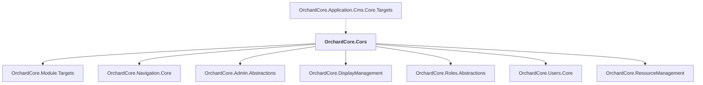

# OrchardCore.Cors

## Overview

| Property | Value |
|----------|-------|
| Category | Library |
| Repository | src |
| Path | `OrchardCore.Modules/OrchardCore.Cors/OrchardCore.Cors.csproj` |
| Project References | 7 |
| NuGet Dependencies | 0 |
| Consumers | 1 |

## Dependency Diagram

## Project References
- OrchardCore.Module.Targets
- OrchardCore.Navigation.Core
- OrchardCore.Admin.Abstractions
- OrchardCore.DisplayManagement
- OrchardCore.Roles.Abstractions
- OrchardCore.Users.Core
- OrchardCore.ResourceManagement

## Consumed By
- OrchardCore.Application.Cms.Core.Targets

---

*[Back to Index](../../index.md)*
