# OrchardCore.CustomSettings

## Overview

| Property | Value |
|----------|-------|
| Category | Library |
| Repository | src |
| Path | `OrchardCore.Modules/OrchardCore.CustomSettings/OrchardCore.CustomSettings.csproj` |
| Project References | 8 |
| NuGet Dependencies | 0 |
| Consumers | 1 |

## Dependency Diagram

```mermaid
graph TD
    OrchardCore_CustomSettings["<strong>OrchardCore.CustomSettings</strong>"]
    OrchardCore_ContentManagement_Abstractions["OrchardCore.ContentManagement.Abstractions"]
    OrchardCore_CustomSettings --> OrchardCore_ContentManagement_Abstractions
    OrchardCore_ContentTypes_Abstractions["OrchardCore.ContentTypes.Abstractions"]
    OrchardCore_CustomSettings --> OrchardCore_ContentTypes_Abstractions
    OrchardCore_Deployment_Abstractions["OrchardCore.Deployment.Abstractions"]
    OrchardCore_CustomSettings --> OrchardCore_Deployment_Abstractions
    OrchardCore_DisplayManagement["OrchardCore.DisplayManagement"]
    OrchardCore_CustomSettings --> OrchardCore_DisplayManagement
    OrchardCore_Module_Targets["OrchardCore.Module.Targets"]
    OrchardCore_CustomSettings --> OrchardCore_Module_Targets
    OrchardCore_Navigation_Core["OrchardCore.Navigation.Core"]
    OrchardCore_CustomSettings --> OrchardCore_Navigation_Core
    OrchardCore_Recipes_Abstractions["OrchardCore.Recipes.Abstractions"]
    OrchardCore_CustomSettings --> OrchardCore_Recipes_Abstractions
    OrchardCore_ResourceManagement["OrchardCore.ResourceManagement"]
    OrchardCore_CustomSettings --> OrchardCore_ResourceManagement
    OrchardCore_Application_Cms_Core_Targets["OrchardCore.Application.Cms.Core.Targets"]
    OrchardCore_Application_Cms_Core_Targets -.-> OrchardCore_CustomSettings
```

## Project References
- OrchardCore.ContentManagement.Abstractions
- OrchardCore.ContentTypes.Abstractions
- OrchardCore.Deployment.Abstractions
- OrchardCore.DisplayManagement
- OrchardCore.Module.Targets
- OrchardCore.Navigation.Core
- OrchardCore.Recipes.Abstractions
- OrchardCore.ResourceManagement

## Consumed By
- OrchardCore.Application.Cms.Core.Targets

---

*[Back to Index](../../index.md)*
