# OrchardCore.Data.Abstractions

## Overview

| Property | Value |
|----------|-------|
| Category | Library |
| Repository | src |
| Path | `OrchardCore/OrchardCore.Data.Abstractions/OrchardCore.Data.Abstractions.csproj` |
| Project References | 1 |
| NuGet Dependencies | 0 |
| Consumers | 46 |

## Dependency Diagram

```mermaid
graph TD
    OrchardCore_Data_Abstractions["<strong>OrchardCore.Data.Abstractions</strong>"]
    OrchardCore_Abstractions["OrchardCore.Abstractions"]
    OrchardCore_Data_Abstractions --> OrchardCore_Abstractions
    OrchardCore_Queries["OrchardCore.Queries"]
    OrchardCore_Queries -.-> OrchardCore_Data_Abstractions
    OrchardCore_Deployment["OrchardCore.Deployment"]
    OrchardCore_Deployment -.-> OrchardCore_Data_Abstractions
    OrchardCore_Shortcodes["OrchardCore.Shortcodes"]
    OrchardCore_Shortcodes -.-> OrchardCore_Data_Abstractions
    OrchardCore_Twitter["OrchardCore.Twitter"]
    OrchardCore_Twitter -.-> OrchardCore_Data_Abstractions
    OrchardCore_BackgroundTasks["OrchardCore.BackgroundTasks"]
    OrchardCore_BackgroundTasks -.-> OrchardCore_Data_Abstractions
    OrchardCore_Settings["OrchardCore.Settings"]
    OrchardCore_Settings -.-> OrchardCore_Data_Abstractions
    OrchardCore_Navigation["OrchardCore.Navigation"]
    OrchardCore_Navigation -.-> OrchardCore_Data_Abstractions
    OrchardCore_Taxonomies["OrchardCore.Taxonomies"]
    OrchardCore_Taxonomies -.-> OrchardCore_Data_Abstractions
    OrchardCore_Flows["OrchardCore.Flows"]
    OrchardCore_Flows -.-> OrchardCore_Data_Abstractions
    OrchardCore_PublishLater["OrchardCore.PublishLater"]
    OrchardCore_PublishLater -.-> OrchardCore_Data_Abstractions
    OrchardCore_Microsoft_Authentication["OrchardCore.Microsoft.Authentication"]
    OrchardCore_Microsoft_Authentication -.-> OrchardCore_Data_Abstractions
    OrchardCore_ArchiveLater["OrchardCore.ArchiveLater"]
    OrchardCore_ArchiveLater -.-> OrchardCore_Data_Abstractions
    OrchardCore_Workflows["OrchardCore.Workflows"]
    OrchardCore_Workflows -.-> OrchardCore_Data_Abstractions
    OrchardCore_Google["OrchardCore.Google"]
    OrchardCore_Google -.-> OrchardCore_Data_Abstractions
    OrchardCore_Users["OrchardCore.Users"]
    OrchardCore_Users -.-> OrchardCore_Data_Abstractions
    more_consumers["... +31 more"]
    more_consumers -.-> OrchardCore_Data_Abstractions
```

## Project References
- OrchardCore.Abstractions

## Consumed By
- OrchardCore.Queries
- OrchardCore.Deployment
- OrchardCore.Shortcodes
- OrchardCore.Twitter
- OrchardCore.BackgroundTasks
- OrchardCore.Settings
- OrchardCore.Navigation
- OrchardCore.Taxonomies
- OrchardCore.Flows
- OrchardCore.PublishLater
- OrchardCore.Microsoft.Authentication
- OrchardCore.ArchiveLater
- OrchardCore.Workflows
- OrchardCore.Google
- OrchardCore.Users
- OrchardCore.OpenId
- OrchardCore.AdminDashboard
- OrchardCore.Admin
- OrchardCore.GitHub
- OrchardCore.Menu
- OrchardCore.Alias
- OrchardCore.Liquid
- OrchardCore.Facebook
- OrchardCore.Layers
- OrchardCore.Search.Lucene
- OrchardCore.Deployment.Remote
- OrchardCore.Media
- OrchardCore.Sitemaps
- OrchardCore.Html
- OrchardCore.Roles
- OrchardCore.Title
- OrchardCore.Recipes
- OrchardCore.Markdown
- OrchardCore.Demo
- OrchardCore.Widgets
- OrchardCore.Templates
- OrchardCore.Spatial
- OrchardCore.ContentLocalization
- OrchardCore.Tenants
- OrchardCore.Placements
- OrchardCore.Recipes.Core
- OrchardCore.UrlRewriting.Core
- OrchardCore.Data
- OrchardCore.Infrastructure.Abstractions
- OrchardCore.Data.YesSql.Abstractions
- OrchardCore.Autoroute.Core

---

*[Back to Index](../../index.md)*
