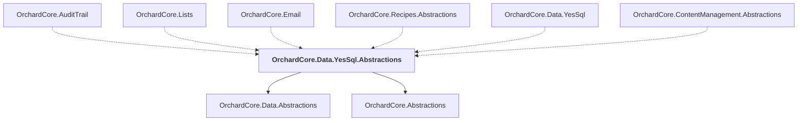

# OrchardCore.Data.YesSql.Abstractions

## Overview

| Property | Value |
|----------|-------|
| Category | Library |
| Repository | src |
| Path | `OrchardCore/OrchardCore.Data.YesSql.Abstractions/OrchardCore.Data.YesSql.Abstractions.csproj` |
| Project References | 2 |
| NuGet Dependencies | 1 |
| Consumers | 6 |

## Dependency Diagram

## Project References
- OrchardCore.Data.Abstractions
- OrchardCore.Abstractions

## Consumed By
- OrchardCore.AuditTrail
- OrchardCore.Lists
- OrchardCore.Email
- OrchardCore.Recipes.Abstractions
- OrchardCore.Data.YesSql
- OrchardCore.ContentManagement.Abstractions

## External NuGet Packages
| Package | Version |
|---------|---------||
| YesSql.Abstractions |  |

---

*[Back to Index](../../index.md)*
