# OrchardCore.Data.YesSql

## Overview

| Property | Value |
|----------|-------|
| Category | Library |
| Repository | src |
| Path | `OrchardCore/OrchardCore.Data.YesSql/OrchardCore.Data.YesSql.csproj` |
| Project References | 3 |
| NuGet Dependencies | 1 |
| Consumers | 9 |

## Dependency Diagram

```mermaid
graph TD
    OrchardCore_Data_YesSql["<strong>OrchardCore.Data.YesSql</strong>"]
    OrchardCore_Data["OrchardCore.Data"]
    OrchardCore_Data_YesSql --> OrchardCore_Data
    OrchardCore_Data_YesSql_Abstractions["OrchardCore.Data.YesSql.Abstractions"]
    OrchardCore_Data_YesSql --> OrchardCore_Data_YesSql_Abstractions
    OrchardCore_Abstractions["OrchardCore.Abstractions"]
    OrchardCore_Data_YesSql --> OrchardCore_Abstractions
    OrchardCore_Deployment["OrchardCore.Deployment"]
    OrchardCore_Deployment -.-> OrchardCore_Data_YesSql
    OrchardCore_PublishLater["OrchardCore.PublishLater"]
    OrchardCore_PublishLater -.-> OrchardCore_Data_YesSql
    OrchardCore_ArchiveLater["OrchardCore.ArchiveLater"]
    OrchardCore_ArchiveLater -.-> OrchardCore_Data_YesSql
    OrchardCore_Workflows["OrchardCore.Workflows"]
    OrchardCore_Workflows -.-> OrchardCore_Data_YesSql
    OrchardCore_Indexing["OrchardCore.Indexing"]
    OrchardCore_Indexing -.-> OrchardCore_Data_YesSql
    OrchardCore_Infrastructure["OrchardCore.Infrastructure"]
    OrchardCore_Infrastructure -.-> OrchardCore_Data_YesSql
    OrchardCore_Users_Core["OrchardCore.Users.Core"]
    OrchardCore_Users_Core -.-> OrchardCore_Data_YesSql
    OrchardCore_ContentManagement["OrchardCore.ContentManagement"]
    OrchardCore_ContentManagement -.-> OrchardCore_Data_YesSql
    OrchardCore_OpenId_Core["OrchardCore.OpenId.Core"]
    OrchardCore_OpenId_Core -.-> OrchardCore_Data_YesSql
```

## Project References
- OrchardCore.Data
- OrchardCore.Data.YesSql.Abstractions
- OrchardCore.Abstractions

## Consumed By
- OrchardCore.Deployment
- OrchardCore.PublishLater
- OrchardCore.ArchiveLater
- OrchardCore.Workflows
- OrchardCore.Indexing
- OrchardCore.Infrastructure
- OrchardCore.Users.Core
- OrchardCore.ContentManagement
- OrchardCore.OpenId.Core

## External NuGet Packages
| Package | Version |
|---------|---------||
| YesSql |  |

---

*[Back to Index](../../index.md)*
