# OrchardCore.DataLocalization

## Overview

| Property | Value |
|----------|-------|
| Category | Localization |
| Repository | src |
| Path | `OrchardCore.Modules/OrchardCore.DataLocalization/OrchardCore.DataLocalization.csproj` |
| Project References | 10 |
| NuGet Dependencies | 0 |
| Consumers | 1 |

## Dependency Diagram

```mermaid
graph TD
    OrchardCore_DataLocalization["<strong>OrchardCore.DataLocalization</strong>"]
    OrchardCore_Apis_GraphQL_Abstractions["OrchardCore.Apis.GraphQL.Abstractions"]
    OrchardCore_DataLocalization --> OrchardCore_Apis_GraphQL_Abstractions
    OrchardCore_Deployment_Abstractions["OrchardCore.Deployment.Abstractions"]
    OrchardCore_DataLocalization --> OrchardCore_Deployment_Abstractions
    OrchardCore_DisplayManagement["OrchardCore.DisplayManagement"]
    OrchardCore_DataLocalization --> OrchardCore_DisplayManagement
    OrchardCore_Localization_Abstractions["OrchardCore.Localization.Abstractions"]
    OrchardCore_DataLocalization --> OrchardCore_Localization_Abstractions
    OrchardCore_Localization_Core["OrchardCore.Localization.Core"]
    OrchardCore_DataLocalization --> OrchardCore_Localization_Core
    OrchardCore_Module_Targets["OrchardCore.Module.Targets"]
    OrchardCore_DataLocalization --> OrchardCore_Module_Targets
    OrchardCore_Navigation_Core["OrchardCore.Navigation.Core"]
    OrchardCore_DataLocalization --> OrchardCore_Navigation_Core
    OrchardCore_ResourceManagement["OrchardCore.ResourceManagement"]
    OrchardCore_DataLocalization --> OrchardCore_ResourceManagement
    OrchardCore_Settings_Core["OrchardCore.Settings.Core"]
    OrchardCore_DataLocalization --> OrchardCore_Settings_Core
    OrchardCore_ContentTypes["OrchardCore.ContentTypes"]
    OrchardCore_DataLocalization --> OrchardCore_ContentTypes
    OrchardCore_Application_Cms_Core_Targets["OrchardCore.Application.Cms.Core.Targets"]
    OrchardCore_Application_Cms_Core_Targets -.-> OrchardCore_DataLocalization
```

## Project References
- OrchardCore.Apis.GraphQL.Abstractions
- OrchardCore.Deployment.Abstractions
- OrchardCore.DisplayManagement
- OrchardCore.Localization.Abstractions
- OrchardCore.Localization.Core
- OrchardCore.Module.Targets
- OrchardCore.Navigation.Core
- OrchardCore.ResourceManagement
- OrchardCore.Settings.Core
- OrchardCore.ContentTypes

## Consumed By
- OrchardCore.Application.Cms.Core.Targets

---

*[Back to Index](../../index.md)*
