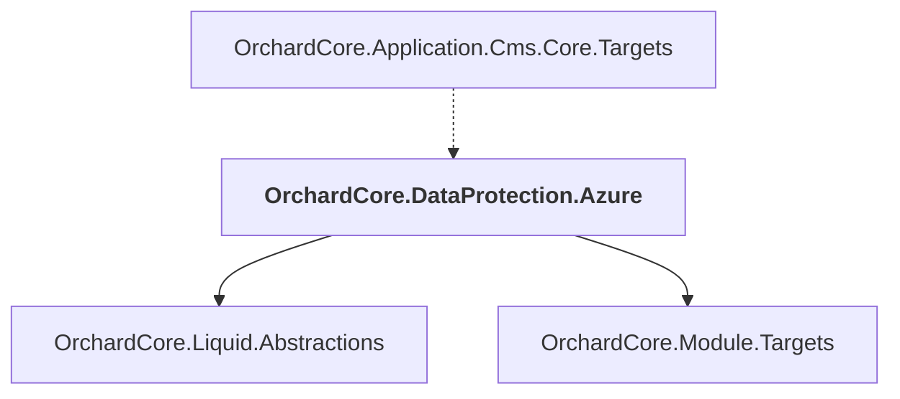

# OrchardCore.DataProtection.Azure

## Overview

| Property | Value |
|----------|-------|
| Category | Library |
| Repository | src |
| Path | `OrchardCore.Modules/OrchardCore.DataProtection.Azure/OrchardCore.DataProtection.Azure.csproj` |
| Project References | 2 |
| NuGet Dependencies | 1 |
| Consumers | 1 |

## Dependency Diagram

## Project References
- OrchardCore.Liquid.Abstractions
- OrchardCore.Module.Targets

## Consumed By
- OrchardCore.Application.Cms.Core.Targets

## External NuGet Packages
| Package | Version |
|---------|---------||
| Azure.Extensions.AspNetCore.DataProtection.Blobs |  |

---

*[Back to Index](../../index.md)*
