# OrchardCore.Demo

## Overview

| Property | Value |
|----------|-------|
| Category | Sample |
| Repository | src |
| Path | `OrchardCore.Modules/OrchardCore.Demo/OrchardCore.Demo.csproj` |
| Project References | 11 |
| NuGet Dependencies | 0 |
| Consumers | 0 |

## Dependency Diagram

```mermaid
graph TD
    OrchardCore_Demo["<strong>OrchardCore.Demo</strong>"]
    OrchardCore_Admin_Abstractions["OrchardCore.Admin.Abstractions"]
    OrchardCore_Demo --> OrchardCore_Admin_Abstractions
    OrchardCore_Apis_GraphQL_Abstractions["OrchardCore.Apis.GraphQL.Abstractions"]
    OrchardCore_Demo --> OrchardCore_Apis_GraphQL_Abstractions
    OrchardCore_ContentManagement_Display["OrchardCore.ContentManagement.Display"]
    OrchardCore_Demo --> OrchardCore_ContentManagement_Display
    OrchardCore_ContentManagement_GraphQL["OrchardCore.ContentManagement.GraphQL"]
    OrchardCore_Demo --> OrchardCore_ContentManagement_GraphQL
    OrchardCore_Contents_TagHelpers["OrchardCore.Contents.TagHelpers"]
    OrchardCore_Demo --> OrchardCore_Contents_TagHelpers
    OrchardCore_Data_Abstractions["OrchardCore.Data.Abstractions"]
    OrchardCore_Demo --> OrchardCore_Data_Abstractions
    OrchardCore_DisplayManagement["OrchardCore.DisplayManagement"]
    OrchardCore_Demo --> OrchardCore_DisplayManagement
    OrchardCore_Module_Targets["OrchardCore.Module.Targets"]
    OrchardCore_Demo --> OrchardCore_Module_Targets
    OrchardCore_Navigation_Core["OrchardCore.Navigation.Core"]
    OrchardCore_Demo --> OrchardCore_Navigation_Core
    OrchardCore_ResourceManagement["OrchardCore.ResourceManagement"]
    OrchardCore_Demo --> OrchardCore_ResourceManagement
    OrchardCore_Users_Core["OrchardCore.Users.Core"]
    OrchardCore_Demo --> OrchardCore_Users_Core
```

## Project References
- OrchardCore.Admin.Abstractions
- OrchardCore.Apis.GraphQL.Abstractions
- OrchardCore.ContentManagement.Display
- OrchardCore.ContentManagement.GraphQL
- OrchardCore.Contents.TagHelpers
- OrchardCore.Data.Abstractions
- OrchardCore.DisplayManagement
- OrchardCore.Module.Targets
- OrchardCore.Navigation.Core
- OrchardCore.ResourceManagement
- OrchardCore.Users.Core

---

*[Back to Index](../../index.md)*
