# OrchardCore.Deployment.Abstractions

## Overview

| Property | Value |
|----------|-------|
| Category | Library |
| Repository | src |
| Path | `OrchardCore/OrchardCore.Deployment.Abstractions/OrchardCore.Deployment.Abstractions.csproj` |
| Project References | 2 |
| NuGet Dependencies | 0 |
| Consumers | 29 |

## Dependency Diagram

```mermaid
graph TD
    OrchardCore_Deployment_Abstractions["<strong>OrchardCore.Deployment.Abstractions</strong>"]
    OrchardCore_Recipes_Abstractions["OrchardCore.Recipes.Abstractions"]
    OrchardCore_Deployment_Abstractions --> OrchardCore_Recipes_Abstractions
    OrchardCore_DisplayManagement["OrchardCore.DisplayManagement"]
    OrchardCore_Deployment_Abstractions --> OrchardCore_DisplayManagement
    OrchardCore_Queries["OrchardCore.Queries"]
    OrchardCore_Queries -.-> OrchardCore_Deployment_Abstractions
    OrchardCore_AdminMenu["OrchardCore.AdminMenu"]
    OrchardCore_AdminMenu -.-> OrchardCore_Deployment_Abstractions
    OrchardCore_Shortcodes["OrchardCore.Shortcodes"]
    OrchardCore_Shortcodes -.-> OrchardCore_Deployment_Abstractions
    OrchardCore_Settings["OrchardCore.Settings"]
    OrchardCore_Settings -.-> OrchardCore_Deployment_Abstractions
    OrchardCore_Features["OrchardCore.Features"]
    OrchardCore_Features -.-> OrchardCore_Deployment_Abstractions
    OrchardCore_Microsoft_Authentication["OrchardCore.Microsoft.Authentication"]
    OrchardCore_Microsoft_Authentication -.-> OrchardCore_Deployment_Abstractions
    OrchardCore_Google["OrchardCore.Google"]
    OrchardCore_Google -.-> OrchardCore_Deployment_Abstractions
    OrchardCore_Themes["OrchardCore.Themes"]
    OrchardCore_Themes -.-> OrchardCore_Deployment_Abstractions
    OrchardCore_OpenId["OrchardCore.OpenId"]
    OrchardCore_OpenId -.-> OrchardCore_Deployment_Abstractions
    OrchardCore_DataLocalization["OrchardCore.DataLocalization"]
    OrchardCore_DataLocalization -.-> OrchardCore_Deployment_Abstractions
    OrchardCore_Contents["OrchardCore.Contents"]
    OrchardCore_Contents -.-> OrchardCore_Deployment_Abstractions
    OrchardCore_Facebook["OrchardCore.Facebook"]
    OrchardCore_Facebook -.-> OrchardCore_Deployment_Abstractions
    OrchardCore_Layers["OrchardCore.Layers"]
    OrchardCore_Layers -.-> OrchardCore_Deployment_Abstractions
    OrchardCore_Search_Lucene["OrchardCore.Search.Lucene"]
    OrchardCore_Search_Lucene -.-> OrchardCore_Deployment_Abstractions
    OrchardCore_Media["OrchardCore.Media"]
    OrchardCore_Media -.-> OrchardCore_Deployment_Abstractions
    more_consumers["... +14 more"]
    more_consumers -.-> OrchardCore_Deployment_Abstractions
```

## Project References
- OrchardCore.Recipes.Abstractions
- OrchardCore.DisplayManagement

## Consumed By
- OrchardCore.Queries
- OrchardCore.AdminMenu
- OrchardCore.Shortcodes
- OrchardCore.Settings
- OrchardCore.Features
- OrchardCore.Microsoft.Authentication
- OrchardCore.Google
- OrchardCore.Themes
- OrchardCore.OpenId
- OrchardCore.DataLocalization
- OrchardCore.Contents
- OrchardCore.Facebook
- OrchardCore.Layers
- OrchardCore.Search.Lucene
- OrchardCore.Media
- OrchardCore.Sitemaps
- OrchardCore.Roles
- OrchardCore.Recipes
- OrchardCore.CustomSettings
- OrchardCore.Templates
- OrchardCore.Indexing
- OrchardCore.ContentTypes
- OrchardCore.Tenants
- OrchardCore.Placements
- OrchardCore.Indexing.Core
- OrchardCore.Search.Elasticsearch.Core
- OrchardCore.Search.AzureAI.Core
- OrchardCore.Settings.Core
- OrchardCore.Deployment.Core

---

*[Back to Index](../../index.md)*
