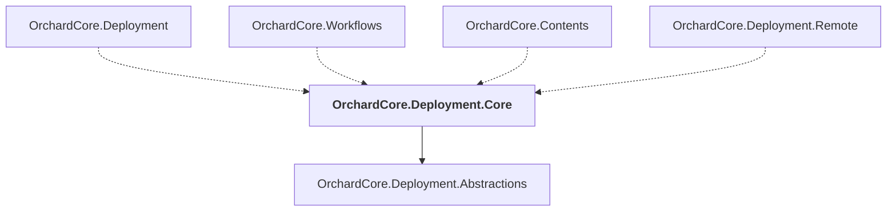

# OrchardCore.Deployment.Core

## Overview

| Property | Value |
|----------|-------|
| Category | Library |
| Repository | src |
| Path | `OrchardCore/OrchardCore.Deployment.Core/OrchardCore.Deployment.Core.csproj` |
| Project References | 1 |
| NuGet Dependencies | 0 |
| Consumers | 4 |

## Dependency Diagram

## Project References
- OrchardCore.Deployment.Abstractions

## Consumed By
- OrchardCore.Deployment
- OrchardCore.Workflows
- OrchardCore.Contents
- OrchardCore.Deployment.Remote

---

*[Back to Index](../../index.md)*
