# OrchardCore.Deployment

## Overview

| Property | Value |
|----------|-------|
| Category | Library |
| Repository | src |
| Path | `OrchardCore.Modules/OrchardCore.Deployment/OrchardCore.Deployment.csproj` |
| Project References | 9 |
| NuGet Dependencies | 0 |
| Consumers | 2 |

## Dependency Diagram

```mermaid
graph TD
    OrchardCore_Deployment["<strong>OrchardCore.Deployment</strong>"]
    OrchardCore_Admin_Abstractions["OrchardCore.Admin.Abstractions"]
    OrchardCore_Deployment --> OrchardCore_Admin_Abstractions
    OrchardCore_Data_Abstractions["OrchardCore.Data.Abstractions"]
    OrchardCore_Deployment --> OrchardCore_Data_Abstractions
    OrchardCore_Data_YesSql["OrchardCore.Data.YesSql"]
    OrchardCore_Deployment --> OrchardCore_Data_YesSql
    OrchardCore_Deployment_Core["OrchardCore.Deployment.Core"]
    OrchardCore_Deployment --> OrchardCore_Deployment_Core
    OrchardCore_DisplayManagement["OrchardCore.DisplayManagement"]
    OrchardCore_Deployment --> OrchardCore_DisplayManagement
    OrchardCore_Localization_Abstractions["OrchardCore.Localization.Abstractions"]
    OrchardCore_Deployment --> OrchardCore_Localization_Abstractions
    OrchardCore_Module_Targets["OrchardCore.Module.Targets"]
    OrchardCore_Deployment --> OrchardCore_Module_Targets
    OrchardCore_Navigation_Core["OrchardCore.Navigation.Core"]
    OrchardCore_Deployment --> OrchardCore_Navigation_Core
    OrchardCore_ResourceManagement["OrchardCore.ResourceManagement"]
    OrchardCore_Deployment --> OrchardCore_ResourceManagement
    OrchardCore_Search["OrchardCore.Search"]
    OrchardCore_Search -.-> OrchardCore_Deployment
    OrchardCore_Application_Cms_Core_Targets["OrchardCore.Application.Cms.Core.Targets"]
    OrchardCore_Application_Cms_Core_Targets -.-> OrchardCore_Deployment
```

## Project References
- OrchardCore.Admin.Abstractions
- OrchardCore.Data.Abstractions
- OrchardCore.Data.YesSql
- OrchardCore.Deployment.Core
- OrchardCore.DisplayManagement
- OrchardCore.Localization.Abstractions
- OrchardCore.Module.Targets
- OrchardCore.Navigation.Core
- OrchardCore.ResourceManagement

## Consumed By
- OrchardCore.Search
- OrchardCore.Application.Cms.Core.Targets

---

*[Back to Index](../../index.md)*
