# OrchardCore.DisplayManagement.Abstractions

## Overview

| Property | Value |
|----------|-------|
| Category | Library |
| Repository | src |
| Path | `OrchardCore/OrchardCore.DisplayManagement.Abstractions/OrchardCore.DisplayManagement.Abstractions.csproj` |
| Project References | 0 |
| NuGet Dependencies | 0 |
| Consumers | 9 |

## Dependency Diagram

```mermaid
graph TD
    OrchardCore_DisplayManagement_Abstractions["<strong>OrchardCore.DisplayManagement.Abstractions</strong>"]
    OrchardCore_Forms["OrchardCore.Forms"]
    OrchardCore_Forms -.-> OrchardCore_DisplayManagement_Abstractions
    OrchardCore_Apis_GraphQL_Abstractions["OrchardCore.Apis.GraphQL.Abstractions"]
    OrchardCore_Apis_GraphQL_Abstractions -.-> OrchardCore_DisplayManagement_Abstractions
    OrchardCore_DisplayManagement["OrchardCore.DisplayManagement"]
    OrchardCore_DisplayManagement -.-> OrchardCore_DisplayManagement_Abstractions
    OrchardCore_Sitemaps_Abstractions["OrchardCore.Sitemaps.Abstractions"]
    OrchardCore_Sitemaps_Abstractions -.-> OrchardCore_DisplayManagement_Abstractions
    OrchardCore_Mvc_Core["OrchardCore.Mvc.Core"]
    OrchardCore_Mvc_Core -.-> OrchardCore_DisplayManagement_Abstractions
    OrchardCore_Feeds_Abstractions["OrchardCore.Feeds.Abstractions"]
    OrchardCore_Feeds_Abstractions -.-> OrchardCore_DisplayManagement_Abstractions
    OrchardCore_Contents_TagHelpers["OrchardCore.Contents.TagHelpers"]
    OrchardCore_Contents_TagHelpers -.-> OrchardCore_DisplayManagement_Abstractions
    OrchardCore_Contents_Core["OrchardCore.Contents.Core"]
    OrchardCore_Contents_Core -.-> OrchardCore_DisplayManagement_Abstractions
    OrchardCore_Users_Core["OrchardCore.Users.Core"]
    OrchardCore_Users_Core -.-> OrchardCore_DisplayManagement_Abstractions
```

## Consumed By
- OrchardCore.Forms
- OrchardCore.Apis.GraphQL.Abstractions
- OrchardCore.DisplayManagement
- OrchardCore.Sitemaps.Abstractions
- OrchardCore.Mvc.Core
- OrchardCore.Feeds.Abstractions
- OrchardCore.Contents.TagHelpers
- OrchardCore.Contents.Core
- OrchardCore.Users.Core

---

*[Back to Index](../../index.md)*
