# OrchardCore.DisplayManagement.Liquid

## Overview

| Property | Value |
|----------|-------|
| Category | Library |
| Repository | src |
| Path | `OrchardCore/OrchardCore.DisplayManagement.Liquid/OrchardCore.DisplayManagement.Liquid.csproj` |
| Project References | 4 |
| NuGet Dependencies | 0 |
| Consumers | 8 |

## Dependency Diagram

```mermaid
graph TD
    OrchardCore_DisplayManagement_Liquid["<strong>OrchardCore.DisplayManagement.Liquid</strong>"]
    OrchardCore_DynamicCache_Abstractions["OrchardCore.DynamicCache.Abstractions"]
    OrchardCore_DisplayManagement_Liquid --> OrchardCore_DynamicCache_Abstractions
    OrchardCore_DisplayManagement["OrchardCore.DisplayManagement"]
    OrchardCore_DisplayManagement_Liquid --> OrchardCore_DisplayManagement
    OrchardCore_Liquid_Abstractions["OrchardCore.Liquid.Abstractions"]
    OrchardCore_DisplayManagement_Liquid --> OrchardCore_Liquid_Abstractions
    OrchardCore_ResourceManagement_Abstractions["OrchardCore.ResourceManagement.Abstractions"]
    OrchardCore_DisplayManagement_Liquid --> OrchardCore_ResourceManagement_Abstractions
    OrchardCore_Resources["OrchardCore.Resources"]
    OrchardCore_Resources -.-> OrchardCore_DisplayManagement_Liquid
    OrchardCore_Workflows["OrchardCore.Workflows"]
    OrchardCore_Workflows -.-> OrchardCore_DisplayManagement_Liquid
    OrchardCore_Autoroute["OrchardCore.Autoroute"]
    OrchardCore_Autoroute -.-> OrchardCore_DisplayManagement_Liquid
    OrchardCore_Liquid["OrchardCore.Liquid"]
    OrchardCore_Liquid -.-> OrchardCore_DisplayManagement_Liquid
    OrchardCore_Contents["OrchardCore.Contents"]
    OrchardCore_Contents -.-> OrchardCore_DisplayManagement_Liquid
    OrchardCore_Facebook["OrchardCore.Facebook"]
    OrchardCore_Facebook -.-> OrchardCore_DisplayManagement_Liquid
    OrchardCore_Media["OrchardCore.Media"]
    OrchardCore_Media -.-> OrchardCore_DisplayManagement_Liquid
    OrchardCore_Templates["OrchardCore.Templates"]
    OrchardCore_Templates -.-> OrchardCore_DisplayManagement_Liquid
```

## Project References
- OrchardCore.DynamicCache.Abstractions
- OrchardCore.DisplayManagement
- OrchardCore.Liquid.Abstractions
- OrchardCore.ResourceManagement.Abstractions

## Consumed By
- OrchardCore.Resources
- OrchardCore.Workflows
- OrchardCore.Autoroute
- OrchardCore.Liquid
- OrchardCore.Contents
- OrchardCore.Facebook
- OrchardCore.Media
- OrchardCore.Templates

---

*[Back to Index](../../index.md)*
