# OrchardCore.DisplayManagement

## Overview

| Property | Value |
|----------|-------|
| Category | Library |
| Repository | src |
| Path | `OrchardCore/OrchardCore.DisplayManagement/OrchardCore.DisplayManagement.csproj` |
| Project References | 5 |
| NuGet Dependencies | 1 |
| Consumers | 88 |

## Dependency Diagram

```mermaid
graph TD
    OrchardCore_DisplayManagement["<strong>OrchardCore.DisplayManagement</strong>"]
    OrchardCore_Infrastructure_Abstractions["OrchardCore.Infrastructure.Abstractions"]
    OrchardCore_DisplayManagement --> OrchardCore_Infrastructure_Abstractions
    OrchardCore_DisplayManagement_Abstractions["OrchardCore.DisplayManagement.Abstractions"]
    OrchardCore_DisplayManagement --> OrchardCore_DisplayManagement_Abstractions
    OrchardCore_Liquid_Abstractions["OrchardCore.Liquid.Abstractions"]
    OrchardCore_DisplayManagement --> OrchardCore_Liquid_Abstractions
    OrchardCore_Localization_Abstractions["OrchardCore.Localization.Abstractions"]
    OrchardCore_DisplayManagement --> OrchardCore_Localization_Abstractions
    OrchardCore_Mvc_Core["OrchardCore.Mvc.Core"]
    OrchardCore_DisplayManagement --> OrchardCore_Mvc_Core
    TheComingSoonTheme["TheComingSoonTheme"]
    TheComingSoonTheme -.-> OrchardCore_DisplayManagement
    TheTheme["TheTheme"]
    TheTheme -.-> OrchardCore_DisplayManagement
    TheBlogTheme["TheBlogTheme"]
    TheBlogTheme -.-> OrchardCore_DisplayManagement
    TheAdmin["TheAdmin"]
    TheAdmin -.-> OrchardCore_DisplayManagement
    TheAgencyTheme["TheAgencyTheme"]
    TheAgencyTheme -.-> OrchardCore_DisplayManagement
    SafeMode["SafeMode"]
    SafeMode -.-> OrchardCore_DisplayManagement
    OrchardCore_Queries["OrchardCore.Queries"]
    OrchardCore_Queries -.-> OrchardCore_DisplayManagement
    OrchardCore_Deployment["OrchardCore.Deployment"]
    OrchardCore_Deployment -.-> OrchardCore_DisplayManagement
    OrchardCore_Shortcodes["OrchardCore.Shortcodes"]
    OrchardCore_Shortcodes -.-> OrchardCore_DisplayManagement
    OrchardCore_Email_Azure["OrchardCore.Email.Azure"]
    OrchardCore_Email_Azure -.-> OrchardCore_DisplayManagement
    OrchardCore_Twitter["OrchardCore.Twitter"]
    OrchardCore_Twitter -.-> OrchardCore_DisplayManagement
    OrchardCore_BackgroundTasks["OrchardCore.BackgroundTasks"]
    OrchardCore_BackgroundTasks -.-> OrchardCore_DisplayManagement
    OrchardCore_Settings["OrchardCore.Settings"]
    OrchardCore_Settings -.-> OrchardCore_DisplayManagement
    OrchardCore_Navigation["OrchardCore.Navigation"]
    OrchardCore_Navigation -.-> OrchardCore_DisplayManagement
    OrchardCore_Features["OrchardCore.Features"]
    OrchardCore_Features -.-> OrchardCore_DisplayManagement
    more_consumers["... +73 more"]
    more_consumers -.-> OrchardCore_DisplayManagement
```

## Project References
- OrchardCore.Infrastructure.Abstractions
- OrchardCore.DisplayManagement.Abstractions
- OrchardCore.Liquid.Abstractions
- OrchardCore.Localization.Abstractions
- OrchardCore.Mvc.Core

## Consumed By
- TheComingSoonTheme
- TheTheme
- TheBlogTheme
- TheAdmin
- TheAgencyTheme
- SafeMode
- OrchardCore.Queries
- OrchardCore.Deployment
- OrchardCore.Shortcodes
- OrchardCore.Email.Azure
- OrchardCore.Twitter
- OrchardCore.BackgroundTasks
- OrchardCore.Settings
- OrchardCore.Navigation
- OrchardCore.Features
- OrchardCore.Taxonomies
- OrchardCore.Setup
- OrchardCore.PublishLater
- OrchardCore.Sms
- OrchardCore.Microsoft.Authentication
- OrchardCore.ArchiveLater
- OrchardCore.Workflows
- OrchardCore.MiniProfiler
- OrchardCore.Google
- OrchardCore.Users
- OrchardCore.Search.Elasticsearch
- OrchardCore.Themes
- OrchardCore.DynamicCache
- OrchardCore.OpenId
- OrchardCore.Rules
- OrchardCore.Admin
- OrchardCore.ReverseProxy
- OrchardCore.DataLocalization
- OrchardCore.GitHub
- OrchardCore.Menu
- OrchardCore.Alias
- OrchardCore.Security
- OrchardCore.Liquid
- OrchardCore.Facebook
- OrchardCore.Layers
- OrchardCore.Search.Lucene
- OrchardCore.Localization
- OrchardCore.Deployment.Remote
- OrchardCore.Seo
- OrchardCore.Html
- OrchardCore.Roles
- OrchardCore.Diagnostics
- OrchardCore.Email
- OrchardCore.Https
- OrchardCore.Recipes
- OrchardCore.Markdown
- OrchardCore.Search
- OrchardCore.Demo
- OrchardCore.Apis.GraphQL
- OrchardCore.CustomSettings
- OrchardCore.Email.Smtp
- OrchardCore.Templates
- OrchardCore.Sms.Azure
- OrchardCore.Cors
- OrchardCore.Indexing
- OrchardCore.ContentLocalization
- OrchardCore.Feeds
- OrchardCore.Forms
- OrchardCore.Search.AzureAI
- OrchardCore.Tenants
- OrchardCore.Placements
- OrchardCore.Search.Abstractions
- OrchardCore.Deployment.Abstractions
- OrchardCore.Workflows.Abstractions
- OrchardCore.Contents.TagHelpers
- OrchardCore.Rules.Core
- OrchardCore.Navigation.Core
- OrchardCore.DisplayManagement.Liquid
- OrchardCore.ContentManagement.Display
- OrchardCore.ReCaptcha.Core
- OrchardCore.Features.Core
- DerivedThemeSample
- BaseThemeSample2
- DerivedThemeSample2
- BaseThemeSample
- Theme.Pages
- Module.Pages
- Examples.Themes.AssyAttrib.Charlie
- Examples.Themes.AssyAttrib.Bravo
- Errors.OrchardCoreThemes.ThemeAndModule
- Examples.Themes.AssyAttrib.Alpha
- Examples.OrchardCoreThemes.Alpha
- Errors.OrchardCoreThemes.TwoPlus

## External NuGet Packages
| Package | Version |
|---------|---------||
| Castle.Core |  |

---

*[Back to Index](../../index.md)*
