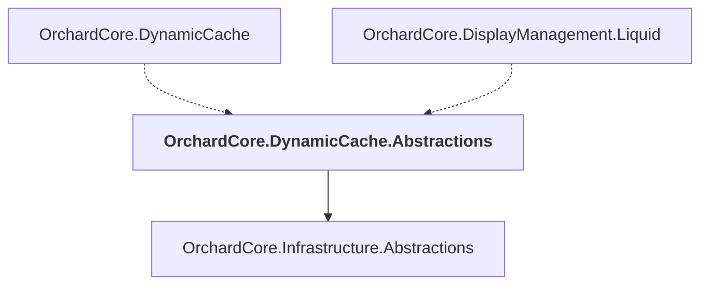

# OrchardCore.DynamicCache.Abstractions

## Overview

| Property | Value |
|----------|-------|
| Category | Library |
| Repository | src |
| Path | `OrchardCore/OrchardCore.DynamicCache.Abstractions/OrchardCore.DynamicCache.Abstractions.csproj` |
| Project References | 1 |
| NuGet Dependencies | 0 |
| Consumers | 2 |

## Dependency Diagram

## Project References
- OrchardCore.Infrastructure.Abstractions

## Consumed By
- OrchardCore.DynamicCache
- OrchardCore.DisplayManagement.Liquid

---

*[Back to Index](../../index.md)*
