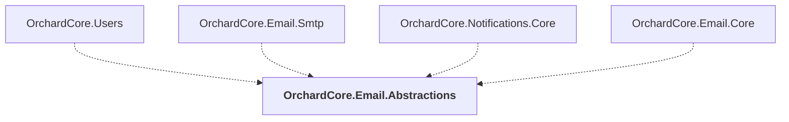

# OrchardCore.Email.Abstractions

## Overview

| Property | Value |
|----------|-------|
| Category | Library |
| Repository | src |
| Path | `OrchardCore/OrchardCore.Email.Abstractions/OrchardCore.Email.Abstractions.csproj` |
| Project References | 0 |
| NuGet Dependencies | 0 |
| Consumers | 4 |

## Dependency Diagram

## Consumed By
- OrchardCore.Users
- OrchardCore.Email.Smtp
- OrchardCore.Notifications.Core
- OrchardCore.Email.Core

---

*[Back to Index](../../index.md)*
