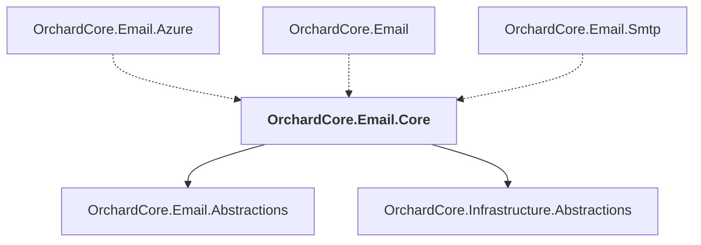

# OrchardCore.Email.Core

## Overview

| Property | Value |
|----------|-------|
| Category | Library |
| Repository | src |
| Path | `OrchardCore/OrchardCore.Email.Core/OrchardCore.Email.Core.csproj` |
| Project References | 2 |
| NuGet Dependencies | 0 |
| Consumers | 3 |

## Dependency Diagram

## Project References
- OrchardCore.Email.Abstractions
- OrchardCore.Infrastructure.Abstractions

## Consumed By
- OrchardCore.Email.Azure
- OrchardCore.Email
- OrchardCore.Email.Smtp

---

*[Back to Index](../../index.md)*
