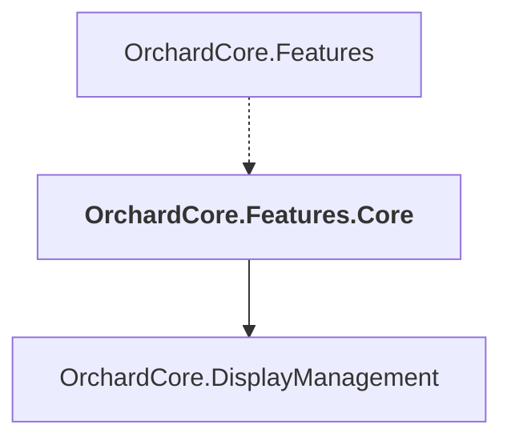

# OrchardCore.Features.Core

## Overview

| Property | Value |
|----------|-------|
| Category | Library |
| Repository | src |
| Path | `OrchardCore/OrchardCore.Features.Core/OrchardCore.Features.Core.csproj` |
| Project References | 1 |
| NuGet Dependencies | 0 |
| Consumers | 1 |

## Dependency Diagram

## Project References
- OrchardCore.DisplayManagement

## Consumed By
- OrchardCore.Features

---

*[Back to Index](../../index.md)*
