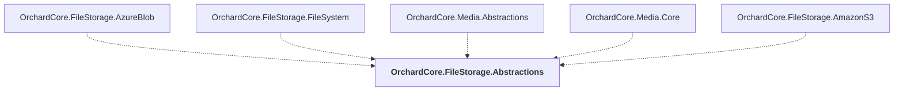

# OrchardCore.FileStorage.Abstractions

## Overview

| Property | Value |
|----------|-------|
| Category | Library |
| Repository | src |
| Path | `OrchardCore/OrchardCore.FileStorage.Abstractions/OrchardCore.FileStorage.Abstractions.csproj` |
| Project References | 0 |
| NuGet Dependencies | 0 |
| Consumers | 5 |

## Dependency Diagram

## Consumed By
- OrchardCore.FileStorage.AzureBlob
- OrchardCore.FileStorage.FileSystem
- OrchardCore.Media.Abstractions
- OrchardCore.Media.Core
- OrchardCore.FileStorage.AmazonS3

---

*[Back to Index](../../index.md)*
