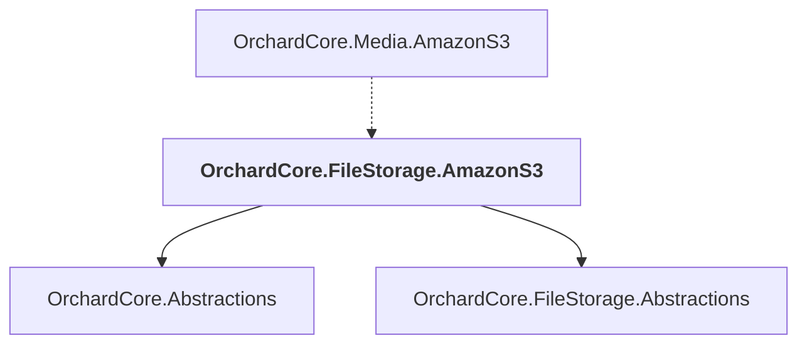

# OrchardCore.FileStorage.AmazonS3

## Overview

| Property | Value |
|----------|-------|
| Category | Library |
| Repository | src |
| Path | `OrchardCore/OrchardCore.FileStorage.AmazonS3/OrchardCore.FileStorage.AmazonS3.csproj` |
| Project References | 2 |
| NuGet Dependencies | 2 |
| Consumers | 1 |

## Dependency Diagram

## Project References
- OrchardCore.Abstractions
- OrchardCore.FileStorage.Abstractions

## Consumed By
- OrchardCore.Media.AmazonS3

## External NuGet Packages
| Package | Version |
|---------|---------||
| AWSSDK.S3 |  |
| AWSSDK.Extensions.NETCore.Setup |  |

---

*[Back to Index](../../index.md)*
