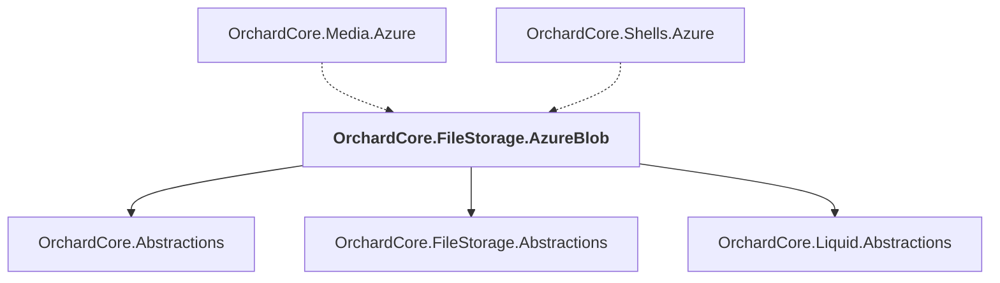

# OrchardCore.FileStorage.AzureBlob

## Overview

| Property | Value |
|----------|-------|
| Category | Library |
| Repository | src |
| Path | `OrchardCore/OrchardCore.FileStorage.AzureBlob/OrchardCore.FileStorage.AzureBlob.csproj` |
| Project References | 3 |
| NuGet Dependencies | 1 |
| Consumers | 2 |

## Dependency Diagram

## Project References
- OrchardCore.Abstractions
- OrchardCore.FileStorage.Abstractions
- OrchardCore.Liquid.Abstractions

## Consumed By
- OrchardCore.Media.Azure
- OrchardCore.Shells.Azure

## External NuGet Packages
| Package | Version |
|---------|---------||
| Azure.Storage.Blobs |  |

---

*[Back to Index](../../index.md)*
