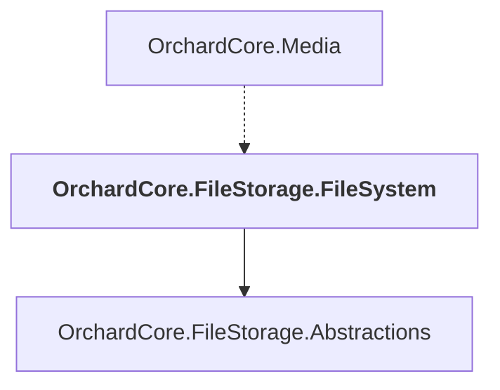

# OrchardCore.FileStorage.FileSystem

## Overview

| Property | Value |
|----------|-------|
| Category | Library |
| Repository | src |
| Path | `OrchardCore/OrchardCore.FileStorage.FileSystem/OrchardCore.FileStorage.FileSystem.csproj` |
| Project References | 1 |
| NuGet Dependencies | 0 |
| Consumers | 1 |

## Dependency Diagram

## Project References
- OrchardCore.FileStorage.Abstractions

## Consumed By
- OrchardCore.Media

---

*[Back to Index](../../index.md)*
