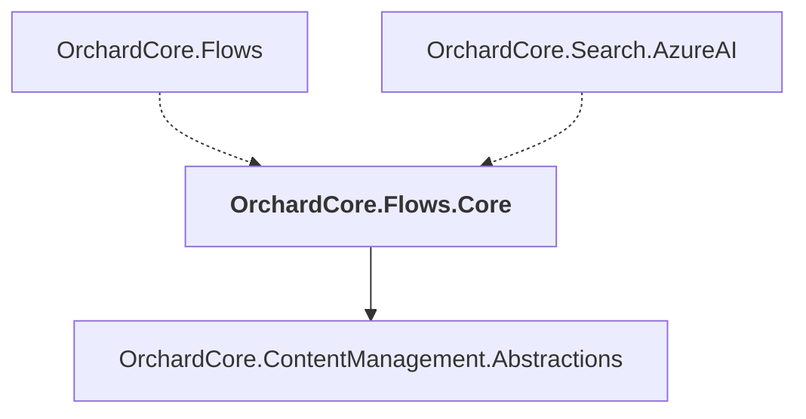

# OrchardCore.Flows.Core

## Overview

| Property | Value |
|----------|-------|
| Category | Library |
| Repository | src |
| Path | `OrchardCore/OrchardCore.Flows.Core/OrchardCore.Flows.Core.csproj` |
| Project References | 1 |
| NuGet Dependencies | 0 |
| Consumers | 2 |

## Dependency Diagram

## Project References
- OrchardCore.ContentManagement.Abstractions

## Consumed By
- OrchardCore.Flows
- OrchardCore.Search.AzureAI

---

*[Back to Index](../../index.md)*
