# OrchardCore.Flows

## Overview

| Property | Value |
|----------|-------|
| Category | Library |
| Repository | src |
| Path | `OrchardCore.Modules/OrchardCore.Flows/OrchardCore.Flows.csproj` |
| Project References | 11 |
| NuGet Dependencies | 0 |
| Consumers | 2 |

## Dependency Diagram

```mermaid
graph TD
    OrchardCore_Flows["<strong>OrchardCore.Flows</strong>"]
    OrchardCore_Admin_Abstractions["OrchardCore.Admin.Abstractions"]
    OrchardCore_Flows --> OrchardCore_Admin_Abstractions
    OrchardCore_ContentManagement_Abstractions["OrchardCore.ContentManagement.Abstractions"]
    OrchardCore_Flows --> OrchardCore_ContentManagement_Abstractions
    OrchardCore_ContentManagement_Display["OrchardCore.ContentManagement.Display"]
    OrchardCore_Flows --> OrchardCore_ContentManagement_Display
    OrchardCore_ContentManagement_GraphQL["OrchardCore.ContentManagement.GraphQL"]
    OrchardCore_Flows --> OrchardCore_ContentManagement_GraphQL
    OrchardCore_ContentTypes_Abstractions["OrchardCore.ContentTypes.Abstractions"]
    OrchardCore_Flows --> OrchardCore_ContentTypes_Abstractions
    OrchardCore_Data_Abstractions["OrchardCore.Data.Abstractions"]
    OrchardCore_Flows --> OrchardCore_Data_Abstractions
    OrchardCore_Flows_Core["OrchardCore.Flows.Core"]
    OrchardCore_Flows --> OrchardCore_Flows_Core
    OrchardCore_Indexing_Abstractions["OrchardCore.Indexing.Abstractions"]
    OrchardCore_Flows --> OrchardCore_Indexing_Abstractions
    OrchardCore_Liquid_Abstractions["OrchardCore.Liquid.Abstractions"]
    OrchardCore_Flows --> OrchardCore_Liquid_Abstractions
    OrchardCore_Module_Targets["OrchardCore.Module.Targets"]
    OrchardCore_Flows --> OrchardCore_Module_Targets
    OrchardCore_ResourceManagement["OrchardCore.ResourceManagement"]
    OrchardCore_Flows --> OrchardCore_ResourceManagement
    TheTheme["TheTheme"]
    TheTheme -.-> OrchardCore_Flows
    OrchardCore_Application_Cms_Core_Targets["OrchardCore.Application.Cms.Core.Targets"]
    OrchardCore_Application_Cms_Core_Targets -.-> OrchardCore_Flows
```

## Project References
- OrchardCore.Admin.Abstractions
- OrchardCore.ContentManagement.Abstractions
- OrchardCore.ContentManagement.Display
- OrchardCore.ContentManagement.GraphQL
- OrchardCore.ContentTypes.Abstractions
- OrchardCore.Data.Abstractions
- OrchardCore.Flows.Core
- OrchardCore.Indexing.Abstractions
- OrchardCore.Liquid.Abstractions
- OrchardCore.Module.Targets
- OrchardCore.ResourceManagement

## Consumed By
- TheTheme
- OrchardCore.Application.Cms.Core.Targets

---

*[Back to Index](../../index.md)*
