# OrchardCore.Forms

## Overview

| Property | Value |
|----------|-------|
| Category | Library |
| Repository | src |
| Path | `OrchardCore.Modules/OrchardCore.Forms/OrchardCore.Forms.csproj` |
| Project References | 8 |
| NuGet Dependencies | 0 |
| Consumers | 1 |

## Dependency Diagram

```mermaid
graph TD
    OrchardCore_Forms["<strong>OrchardCore.Forms</strong>"]
    OrchardCore_Apis_GraphQL_Abstractions["OrchardCore.Apis.GraphQL.Abstractions"]
    OrchardCore_Forms --> OrchardCore_Apis_GraphQL_Abstractions
    OrchardCore_ContentManagement_Display["OrchardCore.ContentManagement.Display"]
    OrchardCore_Forms --> OrchardCore_ContentManagement_Display
    OrchardCore_DisplayManagement_Abstractions["OrchardCore.DisplayManagement.Abstractions"]
    OrchardCore_Forms --> OrchardCore_DisplayManagement_Abstractions
    OrchardCore_DisplayManagement["OrchardCore.DisplayManagement"]
    OrchardCore_Forms --> OrchardCore_DisplayManagement
    OrchardCore_Navigation_Core["OrchardCore.Navigation.Core"]
    OrchardCore_Forms --> OrchardCore_Navigation_Core
    OrchardCore_Module_Targets["OrchardCore.Module.Targets"]
    OrchardCore_Forms --> OrchardCore_Module_Targets
    OrchardCore_ResourceManagement["OrchardCore.ResourceManagement"]
    OrchardCore_Forms --> OrchardCore_ResourceManagement
    OrchardCore_Workflows_Abstractions["OrchardCore.Workflows.Abstractions"]
    OrchardCore_Forms --> OrchardCore_Workflows_Abstractions
    OrchardCore_Application_Cms_Core_Targets["OrchardCore.Application.Cms.Core.Targets"]
    OrchardCore_Application_Cms_Core_Targets -.-> OrchardCore_Forms
```

## Project References
- OrchardCore.Apis.GraphQL.Abstractions
- OrchardCore.ContentManagement.Display
- OrchardCore.DisplayManagement.Abstractions
- OrchardCore.DisplayManagement
- OrchardCore.Navigation.Core
- OrchardCore.Module.Targets
- OrchardCore.ResourceManagement
- OrchardCore.Workflows.Abstractions

## Consumed By
- OrchardCore.Application.Cms.Core.Targets

---

*[Back to Index](../../index.md)*
