# OrchardCore.Indexing.Abstractions

## Overview

| Property | Value |
|----------|-------|
| Category | Library |
| Repository | src |
| Path | `OrchardCore/OrchardCore.Indexing.Abstractions/OrchardCore.Indexing.Abstractions.csproj` |
| Project References | 2 |
| NuGet Dependencies | 0 |
| Consumers | 22 |

## Dependency Diagram

```mermaid
graph TD
    OrchardCore_Indexing_Abstractions["<strong>OrchardCore.Indexing.Abstractions</strong>"]
    OrchardCore_ContentManagement_Abstractions["OrchardCore.ContentManagement.Abstractions"]
    OrchardCore_Indexing_Abstractions --> OrchardCore_ContentManagement_Abstractions
    OrchardCore_Infrastructure_Abstractions["OrchardCore.Infrastructure.Abstractions"]
    OrchardCore_Indexing_Abstractions --> OrchardCore_Infrastructure_Abstractions
    OrchardCore_Taxonomies["OrchardCore.Taxonomies"]
    OrchardCore_Taxonomies -.-> OrchardCore_Indexing_Abstractions
    OrchardCore_Flows["OrchardCore.Flows"]
    OrchardCore_Flows -.-> OrchardCore_Indexing_Abstractions
    OrchardCore_Media_Indexing_Pdf["OrchardCore.Media.Indexing.Pdf"]
    OrchardCore_Media_Indexing_Pdf -.-> OrchardCore_Indexing_Abstractions
    OrchardCore_ContentFields["OrchardCore.ContentFields"]
    OrchardCore_ContentFields -.-> OrchardCore_Indexing_Abstractions
    OrchardCore_Autoroute["OrchardCore.Autoroute"]
    OrchardCore_Autoroute -.-> OrchardCore_Indexing_Abstractions
    OrchardCore_Alias["OrchardCore.Alias"]
    OrchardCore_Alias -.-> OrchardCore_Indexing_Abstractions
    OrchardCore_Liquid["OrchardCore.Liquid"]
    OrchardCore_Liquid -.-> OrchardCore_Indexing_Abstractions
    OrchardCore_Lists["OrchardCore.Lists"]
    OrchardCore_Lists -.-> OrchardCore_Indexing_Abstractions
    OrchardCore_Contents["OrchardCore.Contents"]
    OrchardCore_Contents -.-> OrchardCore_Indexing_Abstractions
    OrchardCore_Search_Lucene["OrchardCore.Search.Lucene"]
    OrchardCore_Search_Lucene -.-> OrchardCore_Indexing_Abstractions
    OrchardCore_Media["OrchardCore.Media"]
    OrchardCore_Media -.-> OrchardCore_Indexing_Abstractions
    OrchardCore_Media_Indexing_OpenXML["OrchardCore.Media.Indexing.OpenXML"]
    OrchardCore_Media_Indexing_OpenXML -.-> OrchardCore_Indexing_Abstractions
    OrchardCore_Html["OrchardCore.Html"]
    OrchardCore_Html -.-> OrchardCore_Indexing_Abstractions
    OrchardCore_Title["OrchardCore.Title"]
    OrchardCore_Title -.-> OrchardCore_Indexing_Abstractions
    OrchardCore_Markdown["OrchardCore.Markdown"]
    OrchardCore_Markdown -.-> OrchardCore_Indexing_Abstractions
    more_consumers["... +7 more"]
    more_consumers -.-> OrchardCore_Indexing_Abstractions
```

## Project References
- OrchardCore.ContentManagement.Abstractions
- OrchardCore.Infrastructure.Abstractions

## Consumed By
- OrchardCore.Taxonomies
- OrchardCore.Flows
- OrchardCore.Media.Indexing.Pdf
- OrchardCore.ContentFields
- OrchardCore.Autoroute
- OrchardCore.Alias
- OrchardCore.Liquid
- OrchardCore.Lists
- OrchardCore.Contents
- OrchardCore.Search.Lucene
- OrchardCore.Media
- OrchardCore.Media.Indexing.OpenXML
- OrchardCore.Html
- OrchardCore.Title
- OrchardCore.Markdown
- OrchardCore.Search
- OrchardCore.Spatial
- OrchardCore.ContentLocalization
- OrchardCore.Search.Abstractions
- OrchardCore.Indexing.Core
- OrchardCore.Search.Elasticsearch.Core
- OrchardCore.Search.Lucene.Core

---

*[Back to Index](../../index.md)*
