# OrchardCore.Indexing.Core

## Overview

| Property | Value |
|----------|-------|
| Category | Library |
| Repository | src |
| Path | `OrchardCore/OrchardCore.Indexing.Core/OrchardCore.Indexing.Core.csproj` |
| Project References | 7 |
| NuGet Dependencies | 0 |
| Consumers | 6 |

## Dependency Diagram

```mermaid
graph TD
    OrchardCore_Indexing_Core["<strong>OrchardCore.Indexing.Core</strong>"]
    OrchardCore_ContentLocalization_Abstractions["OrchardCore.ContentLocalization.Abstractions"]
    OrchardCore_Indexing_Core --> OrchardCore_ContentLocalization_Abstractions
    OrchardCore_ContentManagement["OrchardCore.ContentManagement"]
    OrchardCore_Indexing_Core --> OrchardCore_ContentManagement
    OrchardCore_ContentPreview_Abstractions["OrchardCore.ContentPreview.Abstractions"]
    OrchardCore_Indexing_Core --> OrchardCore_ContentPreview_Abstractions
    OrchardCore_Deployment_Abstractions["OrchardCore.Deployment.Abstractions"]
    OrchardCore_Indexing_Core --> OrchardCore_Deployment_Abstractions
    OrchardCore_Indexing_Abstractions["OrchardCore.Indexing.Abstractions"]
    OrchardCore_Indexing_Core --> OrchardCore_Indexing_Abstractions
    OrchardCore_Infrastructure_Abstractions["OrchardCore.Infrastructure.Abstractions"]
    OrchardCore_Indexing_Core --> OrchardCore_Infrastructure_Abstractions
    OrchardCore_Search_Abstractions["OrchardCore.Search.Abstractions"]
    OrchardCore_Indexing_Core --> OrchardCore_Search_Abstractions
    OrchardCore_Search_Lucene["OrchardCore.Search.Lucene"]
    OrchardCore_Search_Lucene -.-> OrchardCore_Indexing_Core
    OrchardCore_Search["OrchardCore.Search"]
    OrchardCore_Search -.-> OrchardCore_Indexing_Core
    OrchardCore_Indexing["OrchardCore.Indexing"]
    OrchardCore_Indexing -.-> OrchardCore_Indexing_Core
    OrchardCore_Search_Elasticsearch_Core["OrchardCore.Search.Elasticsearch.Core"]
    OrchardCore_Search_Elasticsearch_Core -.-> OrchardCore_Indexing_Core
    OrchardCore_Search_Lucene_Core["OrchardCore.Search.Lucene.Core"]
    OrchardCore_Search_Lucene_Core -.-> OrchardCore_Indexing_Core
    OrchardCore_Search_AzureAI_Core["OrchardCore.Search.AzureAI.Core"]
    OrchardCore_Search_AzureAI_Core -.-> OrchardCore_Indexing_Core
```

## Project References
- OrchardCore.ContentLocalization.Abstractions
- OrchardCore.ContentManagement
- OrchardCore.ContentPreview.Abstractions
- OrchardCore.Deployment.Abstractions
- OrchardCore.Indexing.Abstractions
- OrchardCore.Infrastructure.Abstractions
- OrchardCore.Search.Abstractions

## Consumed By
- OrchardCore.Search.Lucene
- OrchardCore.Search
- OrchardCore.Indexing
- OrchardCore.Search.Elasticsearch.Core
- OrchardCore.Search.Lucene.Core
- OrchardCore.Search.AzureAI.Core

---

*[Back to Index](../../index.md)*
