# OrchardCore.Indexing

## Overview

| Property | Value |
|----------|-------|
| Category | Library |
| Repository | src |
| Path | `OrchardCore.Modules/OrchardCore.Indexing/OrchardCore.Indexing.csproj` |
| Project References | 11 |
| NuGet Dependencies | 0 |
| Consumers | 3 |

## Dependency Diagram

```mermaid
graph TD
    OrchardCore_Indexing["<strong>OrchardCore.Indexing</strong>"]
    OrchardCore_Admin_Abstractions["OrchardCore.Admin.Abstractions"]
    OrchardCore_Indexing --> OrchardCore_Admin_Abstractions
    OrchardCore_ContentPreview_Abstractions["OrchardCore.ContentPreview.Abstractions"]
    OrchardCore_Indexing --> OrchardCore_ContentPreview_Abstractions
    OrchardCore_ContentTypes_Abstractions["OrchardCore.ContentTypes.Abstractions"]
    OrchardCore_Indexing --> OrchardCore_ContentTypes_Abstractions
    OrchardCore_Data_YesSql["OrchardCore.Data.YesSql"]
    OrchardCore_Indexing --> OrchardCore_Data_YesSql
    OrchardCore_Deployment_Abstractions["OrchardCore.Deployment.Abstractions"]
    OrchardCore_Indexing --> OrchardCore_Deployment_Abstractions
    OrchardCore_DisplayManagement["OrchardCore.DisplayManagement"]
    OrchardCore_Indexing --> OrchardCore_DisplayManagement
    OrchardCore_Indexing_Core["OrchardCore.Indexing.Core"]
    OrchardCore_Indexing --> OrchardCore_Indexing_Core
    OrchardCore_Module_Targets["OrchardCore.Module.Targets"]
    OrchardCore_Indexing --> OrchardCore_Module_Targets
    OrchardCore_Navigation_Core["OrchardCore.Navigation.Core"]
    OrchardCore_Indexing --> OrchardCore_Navigation_Core
    OrchardCore_Recipes_Abstractions["OrchardCore.Recipes.Abstractions"]
    OrchardCore_Indexing --> OrchardCore_Recipes_Abstractions
    OrchardCore_ResourceManagement["OrchardCore.ResourceManagement"]
    OrchardCore_Indexing --> OrchardCore_ResourceManagement
    OrchardCore_Seo["OrchardCore.Seo"]
    OrchardCore_Seo -.-> OrchardCore_Indexing
    OrchardCore_Application_Cms_Core_Targets["OrchardCore.Application.Cms.Core.Targets"]
    OrchardCore_Application_Cms_Core_Targets -.-> OrchardCore_Indexing
    OrchardCore_Search_AzureAI_Core["OrchardCore.Search.AzureAI.Core"]
    OrchardCore_Search_AzureAI_Core -.-> OrchardCore_Indexing
```

## Project References
- OrchardCore.Admin.Abstractions
- OrchardCore.ContentPreview.Abstractions
- OrchardCore.ContentTypes.Abstractions
- OrchardCore.Data.YesSql
- OrchardCore.Deployment.Abstractions
- OrchardCore.DisplayManagement
- OrchardCore.Indexing.Core
- OrchardCore.Module.Targets
- OrchardCore.Navigation.Core
- OrchardCore.Recipes.Abstractions
- OrchardCore.ResourceManagement

## Consumed By
- OrchardCore.Seo
- OrchardCore.Application.Cms.Core.Targets
- OrchardCore.Search.AzureAI.Core

---

*[Back to Index](../../index.md)*
