# OrchardCore.Infrastructure.Abstractions

## Overview

| Property | Value |
|----------|-------|
| Category | Library |
| Repository | src |
| Path | `OrchardCore/OrchardCore.Infrastructure.Abstractions/OrchardCore.Infrastructure.Abstractions.csproj` |
| Project References | 3 |
| NuGet Dependencies | 0 |
| Consumers | 43 |

## Dependency Diagram

```mermaid
graph TD
    OrchardCore_Infrastructure_Abstractions["<strong>OrchardCore.Infrastructure.Abstractions</strong>"]
    OrchardCore_Abstractions["OrchardCore.Abstractions"]
    OrchardCore_Infrastructure_Abstractions --> OrchardCore_Abstractions
    OrchardCore_Data_Abstractions["OrchardCore.Data.Abstractions"]
    OrchardCore_Infrastructure_Abstractions --> OrchardCore_Data_Abstractions
    OrchardCore_ResourceManagement_Abstractions["OrchardCore.ResourceManagement.Abstractions"]
    OrchardCore_Infrastructure_Abstractions --> OrchardCore_ResourceManagement_Abstractions
    OrchardCore_Media_Azure["OrchardCore.Media.Azure"]
    OrchardCore_Media_Azure -.-> OrchardCore_Infrastructure_Abstractions
    OrchardCore_Setup["OrchardCore.Setup"]
    OrchardCore_Setup -.-> OrchardCore_Infrastructure_Abstractions
    OrchardCore_Users["OrchardCore.Users"]
    OrchardCore_Users -.-> OrchardCore_Infrastructure_Abstractions
    OrchardCore_Media_AmazonS3["OrchardCore.Media.AmazonS3"]
    OrchardCore_Media_AmazonS3 -.-> OrchardCore_Infrastructure_Abstractions
    OrchardCore_HomeRoute["OrchardCore.HomeRoute"]
    OrchardCore_HomeRoute -.-> OrchardCore_Infrastructure_Abstractions
    OrchardCore_Redis["OrchardCore.Redis"]
    OrchardCore_Redis -.-> OrchardCore_Infrastructure_Abstractions
    OrchardCore_Tenants["OrchardCore.Tenants"]
    OrchardCore_Tenants -.-> OrchardCore_Infrastructure_Abstractions
    OrchardCore_Setup_Core["OrchardCore.Setup.Core"]
    OrchardCore_Setup_Core -.-> OrchardCore_Infrastructure_Abstractions
    OrchardCore_Shortcodes_Abstractions["OrchardCore.Shortcodes.Abstractions"]
    OrchardCore_Shortcodes_Abstractions -.-> OrchardCore_Infrastructure_Abstractions
    OrchardCore_Indexing_Core["OrchardCore.Indexing.Core"]
    OrchardCore_Indexing_Core -.-> OrchardCore_Infrastructure_Abstractions
    OrchardCore_Apis_GraphQL_Abstractions["OrchardCore.Apis.GraphQL.Abstractions"]
    OrchardCore_Apis_GraphQL_Abstractions -.-> OrchardCore_Infrastructure_Abstractions
    OrchardCore_DisplayManagement["OrchardCore.DisplayManagement"]
    OrchardCore_DisplayManagement -.-> OrchardCore_Infrastructure_Abstractions
    OrchardCore_Recipes_Core["OrchardCore.Recipes.Core"]
    OrchardCore_Recipes_Core -.-> OrchardCore_Infrastructure_Abstractions
    OrchardCore_UrlRewriting_Core["OrchardCore.UrlRewriting.Core"]
    OrchardCore_UrlRewriting_Core -.-> OrchardCore_Infrastructure_Abstractions
    OrchardCore_Sitemaps_Abstractions["OrchardCore.Sitemaps.Abstractions"]
    OrchardCore_Sitemaps_Abstractions -.-> OrchardCore_Infrastructure_Abstractions
    more_consumers["... +28 more"]
    more_consumers -.-> OrchardCore_Infrastructure_Abstractions
```

## Project References
- OrchardCore.Abstractions
- OrchardCore.Data.Abstractions
- OrchardCore.ResourceManagement.Abstractions

## Consumed By
- OrchardCore.Media.Azure
- OrchardCore.Setup
- OrchardCore.Users
- OrchardCore.Media.AmazonS3
- OrchardCore.HomeRoute
- OrchardCore.Redis
- OrchardCore.Tenants
- OrchardCore.Setup.Core
- OrchardCore.Shortcodes.Abstractions
- OrchardCore.Indexing.Core
- OrchardCore.Apis.GraphQL.Abstractions
- OrchardCore.DisplayManagement
- OrchardCore.Recipes.Core
- OrchardCore.UrlRewriting.Core
- OrchardCore.Sitemaps.Abstractions
- OrchardCore.Queries.Abstractions
- OrchardCore.Email.Core
- OrchardCore.Indexing.Abstractions
- OrchardCore.Contents.TagHelpers
- OrchardCore.Search.AzureAI.Core
- OrchardCore.Localization.Core
- OrchardCore.Seo.Abstractions
- OrchardCore.Users.Abstractions
- OrchardCore.Infrastructure
- OrchardCore.Navigation.Core
- OrchardCore.Roles.Abstractions
- OrchardCore.Media.Core
- OrchardCore.Roles.Core
- OrchardCore.Scripting.JavaScript
- OrchardCore.Localization.Abstractions
- OrchardCore.Contents.Core
- OrchardCore.Users.Core
- OrchardCore
- OrchardCore.Autoroute.Core
- OrchardCore.Rules.Abstractions
- OrchardCore.Notifications.Abstractions
- OrchardCore.ContentManagement
- OrchardCore.Sms.Core
- OrchardCore.OpenId.Core
- OrchardCore.DynamicCache.Abstractions
- OrchardCore.Admin.Abstractions
- OrchardCore.ContentLocalization.Abstractions
- OrchardCore.UrlRewriting.Abstractions

---

*[Back to Index](../../index.md)*
